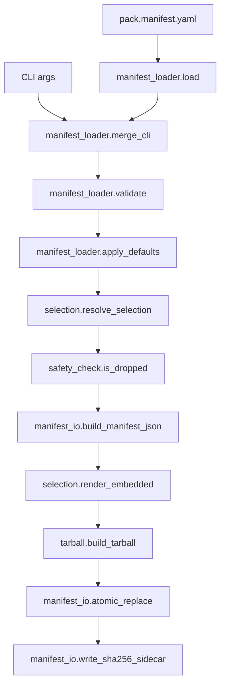

# maintainers-guide

For developers extending `cleanmatic:claude-pack`. Architecture + the common change recipes.

## 1. Architecture Overview



| Module | Responsibility |
|--------|----------------|
| `pack/args.py` | argparse setup (`BooleanOptionalAction`), epoch resolution. |
| `pack/cli.py` | dispatch: load → validate → resolve → build → write. |
| `pack/selection.py` | manifest → `(src, arcname)` tuples (file-granular sorted walk) + template render. |
| `pack/tarball.py` | deterministic gzip+tar writer, normalize filter, gzip-mtime verify. |
| `pack/manifest_io.py` | MANIFEST.json, SHA256 sidecar, atomic replace, tmp cleanup. |
| `pack/pipeline.py` | Build-stage helpers: `prepare_build` (selection + safety), `write_tarball` (tarball + sidecar + atomic replace). Owns exit codes 3 (collision), 4 (write error), 5 (empty/oversize). |
| `pack/templates.py` | `{{TOKEN}}` substitution with `TemplateError` on unknown. |
| `safety_check.py` | always-drop catalog, opt-in catalog, `_shared/` ref detection. |
| `manifest_loader.py` | YAML load, CLI merge, hardened validation, defaults. |
| `build_manifest.py` | discover / list-questions / write (interactive UI is the LLM). |

Every `pack/*.py` stays under 200 LOC (enforced by `test_pack_determinism.py::test_pack_subpackage_loc_budget`). If a module grows past that, split it (as `cli.py` was split into `args.py` + `selection.py`) and record the split in the plan's API Contracts before merging.

## 2. Adding a New Always-Drop Rule

1. Pick the layer in `safety_check.py`:
 - exact basename → `ALWAYS_DROP_EXACT`
 - any path component → `ALWAYS_DROP_DIRS`
 - fnmatch glob → `ALWAYS_DROP_PATTERNS`
2. Add the entry (keep the frozenset/tuple sorted by theme).
3. Document it in `references/safety-rules.md` with a one-line rationale.
4. Add a pytest case in `scripts/tests/test_safety_check.py`.
5. Bump `CHANGELOG.md` under `### Added`.

## 3. Bumping the Manifest Schema

`schema_version` follows semver (see `manifest-spec.md` → Schema Migration):

- **Patch/minor:** additive optional fields with defaults. Add to `ALLOWED_TOP_LEVEL_KEYS` / `ALLOWED_NESTED_TOP_LEVEL_KEYS` / `ALLOWED_DEFAULTS_KEYS` in `manifest_loader.py`. Old manifests keep parsing.
- **Major:** add the new version to `SUPPORTED_SCHEMA_VERSIONS`; keep refusing the unsupported gap with `MANIFEST_E101`. Document the migration path in CHANGELOG.

Update `MANIFEST_SCHEMA_VERSION` in `manifest_io.py` if the embedded `MANIFEST.json` shape changes (separate from the input-manifest schema).

## 4. Refreshing the Golden Test

The synthetic golden (`test_golden_synthetic.py`) asserts an exact file set (`EXPECTED_FILES`). If you change what the synthetic fixture ships, update `EXPECTED_FILES` to match.

The live integration golden (`test_golden_product_spec.py`, `@pytest.mark.integration`) asserts structural invariants (MANIFEST present, no secrets) rather than an exact set, so product-spec edits don't break it. Run it locally with:

```bash
.claude/skills/.venv/bin/python3 -m pytest scripts/tests -m integration
```

CI does NOT gate on the integration marker (weekly cron only). To trigger it on demand:

```bash
gh workflow run claude-pack-integration.yml
```

## 5. Debugging Non-Determinism

If two builds of the same source differ:

1. Verify the gzip mtime byte: `python -c "print(open('x.tar.gz','rb').read(8)[4:8])"` must be `b'\x00\x00\x00\x00'`.
2. Confirm `SOURCE_DATE_EPOCH` isn't leaking from your shell (`echo $SOURCE_DATE_EPOCH`). The test suite clears it via an autouse conftest fixture; your shell may not.
3. Check the sort key: selection sorts by `arcname.encode("utf-8")` — locale-independent. Never sort by locale-collated strings.
4. Confirm you're not calling `tar.add(directory)` anywhere (recursive add is non-deterministic across filesystems). Always per-file `addfile`.
5. Reproduce across the CI matrix (Ubuntu/macOS/Windows × Python 3.11/3.12/3.13) — APFS/NTFS timestamp precision differences are masked by `mtime=0`.

## 6. Adding a CLI Flag

Touch points (keep all four in sync):

1. `pack/args.py` — add the `add_argument` (use `_add_bool` for booleans so `default=None` precedence holds).
2. `manifest_loader.merge_cli` — wire the CLI value into the manifest if it maps to a manifest field.
3. `references/flag-reference.md` — add a table row (flag, type, default, manifest equivalent, description) + an example.
4. `SKILL.md` Flags table — add the user-facing one-liner.

If the flag changes a locked CLI or exit-code contract, update `references/flag-reference.md` + `references/error-catalog.md` first — those are the durable homes for the contract.
