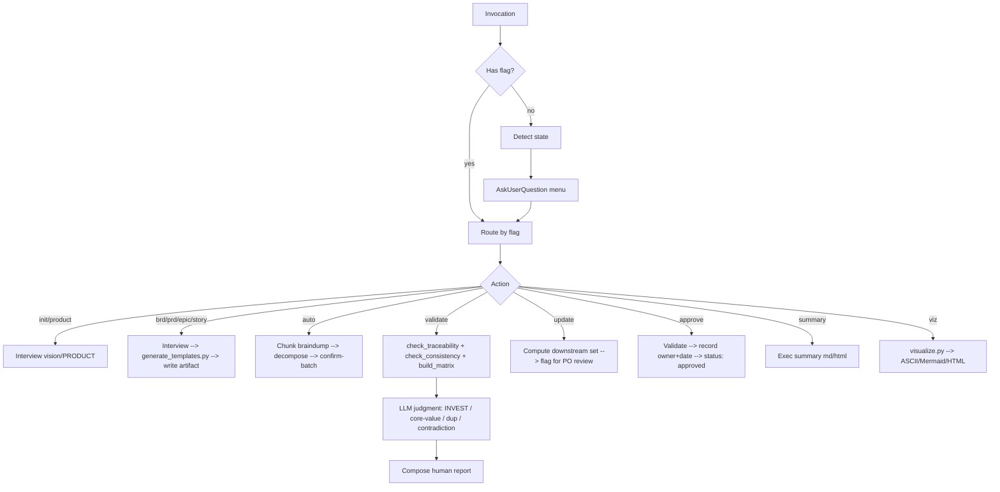

# cleanmatic:product-spec

Product-Owner-facing skill for building and maintaining a strictly-traceable spec hierarchy: **Vision → 1 BRD → many PRDs → Epics → Stories(+AC)**. Drives a phased PO interview (bilingual EN/VI), persists artifacts as markdown with rich YAML frontmatter under `docs/product/`, validates structure deterministically and judgment via LLM, and visualizes the spec tree in ASCII, Mermaid, and self-contained HTML.

## When to Use

- A product owner needs to capture a new product (vision → stories) without writing code.
- An existing spec needs a new BRD/PRD/Epic/Story, delta update, sign-off, or summary.
- A PO has a brain-dump that needs decomposing into the canonical hierarchy.
- A spec needs validation (orphans, missing AC, INVEST quality, core-value drift, contradiction).
- A spec needs visualizing (traceability tree, roadmap, MoSCoW, gap-analysis, …).

## Flags

| Flag | Purpose |
|------|---------|
| (no flag) | Detect state → present menu (init / new BRD / new PRD / add stories / validate / update / visualize / approve / summary). |
| `--product` | Init/refresh PRODUCT.md (thin product-context labels). |
| `--brd` | Create/refine the single BRD. |
| `--prd [feature]` | Create/refine a PRD (feature-area). Multi-PRD supported. |
| `--epic [prd]` | Create/refine an epic under the given PRD. |
| `--story [epic]` | Create/refine a story under the given epic. |
| `--auto` | Brain-dump → decompose into BRD goals / PRDs / epics / stories; confirm-batch on ambiguous splits. |
| `--validate` | Run structural scripts → layer LLM judgment → human report. |
| `--strict` | With `--validate`: errors block; warns do not. |
| `--summary` | Generate 1-page exec summary (markdown + optional HTML). |
| `--approve` | Validate → warn-not-block → record owner+date → flip `status: approved`. |
| `--update` | Delta-update: ask what changed → compute affected downstream set → flag for PO review (never auto-rewrite prose) → append change-log. |
| `--viz <view>` | Render visualization (default ASCII). Views: `tree`, `heatmap`, `scope`, `roadmap`, `persona`, `gap`, `moscow`, `risk`, `delta`. |
| `--format <fmt>` | Visualization format: `ascii` (default) · `mermaid` · `html`. |
| `--lang <code>` | Interview/output language: `en` (default) · `vi`. IDs and frontmatter keys stay English. |

## No-Flag Menu

When invoked without a flag, the skill inspects `docs/product/`:

- No `PRODUCT.md` → offer **Init product** (guided vision interview → write PRODUCT.md + vision.md).
- `PRODUCT.md` exists → present **AskUserQuestion** menu:
  1. New BRD / refine BRD
  2. New PRD (feature-area)
  3. Add stories under existing epic
  4. Validate spec (structural + judgment)
  5. Update (delta — flag affected nodes for review)
  6. Visualize (pick view + format)
  7. Approve (sign-off)
  8. Summary (1-page exec summary)

## Output Contract (in the user's project)

All PO artifacts live under `docs/product/`. The skill never writes prose outside this tree.

```
docs/product/
├── PRODUCT.md                # thin product-context labels (DRY home for facts)
├── vision.md                 # narrative vision + personas + north-star (horizon lives in PRODUCT.md)
├── brd.md                    # single BRD (business goals + metrics + stakeholders)
├── prds/<slug>.md            # one PRD per feature-area
├── epics/<id>.md             # epics referenced from PRDs
├── stories/<id>.md           # stories referenced from epics, with AC
├── exec-summary.md           # generated 1-page summary
├── .session.md               # interview session state (committed; resumable)
├── change-log.md             # append-only delta log
└── visuals/                  # rendered visualizations (ASCII / Mermaid / HTML)
    └── .snapshots/           # graph-snapshot JSONs for delta/diff
```

## Workflow Map



## Loads `references/*` on Demand

The lean skeleton above stays under ~300 lines; full prose lives in `references/`:

- `references/frontmatter-and-id-spec.md` — canonical YAML schema per artifact + parent-scoped ID grammar (`BRD-G1`, `PRD-AUTH`, `PRD-AUTH-E1`, `PRD-AUTH-E1-S1`).
- `references/document-model-and-hierarchy.md` — artifact roles, DRY rule, hierarchy diagram, content-ownership table.
- `references/validation-rules-spec.md` — check catalog (script vs LLM), severities, findings JSON schema, `--strict` gate.
- `references/visualization-spec.md` — 9 views × 3 formats, graph-JSON shape, flag mapping.
- `references/interview-vision.md`, `interview-brd.md`, `interview-prd.md`, `interview-epic-story.md`, `interview-frameworks.md` — bilingual EN/VI question banks + 5-Why / MoSCoW / story-mapping prompts.
- `references/workflow-interview.md`, `workflow-validate.md`, `workflow-auto-and-update.md` — end-to-end workflows the LLM executes (deep prose).

Load only the references relevant to the active flag. Skill resources (`scripts/`, `assets/templates/`, `assets/vendor/`) sit alongside.

## Resources

- `scripts/` — Python (stdlib + pyyaml). Run via repo venv `./.claude/skills/.venv/bin/python3`. Each script accepts `--root <project-dir>` (default CWD) and emits JSON. All judgment lives in the LLM layer; scripts are structural-only.
- `assets/templates/` — markdown templates with `{{token}}` substitution and `<!-- OPTIONAL: … -->` markers.
- `assets/vendor/mermaid.min.js` — vendored Mermaid JS for self-contained offline HTML output.
- `eval/evals.json` — scenario evals (init / auto / validate / delta+viz).
- `examples/` — worked sample product spec.

## Operating Principles

- **PO-facing.** No code in prose. No engineering jargon. Personas, value, scope, AC — in plain language.
- **Frontmatter is source-of-truth.** Scripts parse YAML; the LLM never infers structure from headings.
- **DRY.** One authoritative home per fact. Cross-reference by ID; do not duplicate prose.
- **Script vs LLM split.** Scripts: structural-only (parse, graph, orphan, AC-count, ID integrity). LLM: judgment (INVEST, vagueness, core-value drift, dup, contradiction).
- **No silent reversals.** A contradiction with an approved decision is surfaced; the PO chooses keep / change / hybrid — the skill never auto-flips.
- **Never overwrite manual prose.** Delta-update flags affected downstream nodes for review; regeneration is opt-in per node.
- **Bilingual.** EN and VI interview banks; IDs and frontmatter keys stay English. VI ships best-effort with a pending-native-review note.

Deeper LLM operating guidance lives in `references/` (loaded on demand by flag) and in the repo-root `CLAUDE.md` (auto-loaded by Claude Code).
