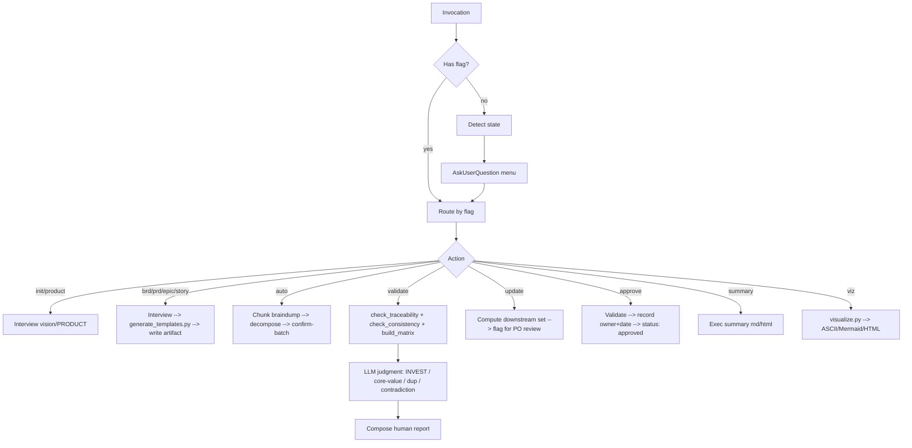

# cleanmatic:product-spec

Product-Owner-facing skill for building and maintaining a strictly-traceable spec hierarchy: **Vision → 1 BRD → many
PRDs → Epics → Stories (+AC)**. Drives a phased PO interview (bilingual EN/VI), persists artifacts as markdown with rich
YAML frontmatter under `docs/product/`, validates structure deterministically and judgment via LLM, and visualizes the
spec tree in ASCII, Mermaid, and self-contained HTML.

## When to Use

- A product owner needs to capture a new product (vision → stories) without writing code.
- An existing spec needs a new BRD/PRD/Epic/Story, delta update, sign-off, or summary.
- A PO has a brain-dump that needs decomposing into the canonical hierarchy.
- A spec needs validation (orphans, missing AC, INVEST quality, core-value drift, contradiction).
- A spec needs visualizing (traceability tree, roadmap, MoSCoW, gap-analysis, …).

## Flags

| Flag                       | Purpose                                                                                                                                                                                                                                                                                                                                                                                     |
|----------------------------|---------------------------------------------------------------------------------------------------------------------------------------------------------------------------------------------------------------------------------------------------------------------------------------------------------------------------------------------------------------------------------------------|
| (no flag)                  | Detect state → present menu (init / new BRD / new PRD / add stories / validate / update / visualize / approve / summary).                                                                                                                                                                                                                                                                   |
| `--product`                | Init/refresh PRODUCT.md (thin product-context labels).                                                                                                                                                                                                                                                                                                                                      |
| `--brd`                    | Create/refine the single BRD.                                                                                                                                                                                                                                                                                                                                                               |
| `--prd [feature]`          | Create/refine a PRD (feature-area). Multi-PRD supported.                                                                                                                                                                                                                                                                                                                                    |
| `--epic [prd]`             | Create/refine an epic under the given PRD.                                                                                                                                                                                                                                                                                                                                                  |
| `--story [epic]`           | Create/refine a story under the given epic.                                                                                                                                                                                                                                                                                                                                                 |
| `--auto`                   | Brain-dump → decompose into BRD goals / PRDs / epics / stories; confirm-batch on ambiguous splits.                                                                                                                                                                                                                                                                                          |
| `--validate`               | Run structural scripts → layer LLM judgment → human report.                                                                                                                                                                                                                                                                                                                                 |
| `--strict`                 | With `--validate`: errors block; warns do not.                                                                                                                                                                                                                                                                                                                                              |
| `--summary`                | Generate 1-page exec summary (markdown + optional HTML).                                                                                                                                                                                                                                                                                                                                    |
| `--approve`                | Validate → warn-not-block → record owner+date → flip `status: approved`.                                                                                                                                                                                                                                                                                                                    |
| `--update`                 | Delta-update: ask what changed → compute affected downstream set → flag for PO review (never auto-rewrite prose) → append change-log.                                                                                                                                                                                                                                                       |
| `--viz <view>`             | Render visualization. ASCII-default graph views: `tree` (text-summary), `heatmap`, `scope`, `roadmap`, `persona`, `gap`, `moscow`, `time` (roadmap + deadlines / Mermaid gantt), `delta`. HTML-native default: `risk`, `competition`, `dashboard` (HTML-only multi-dim). Body viewers (default `html`): `board` (kanban), `explorer` (Tree/Flat-tabs/Table-tree).                           |
| `--format <fmt>`           | Visualization format: `ascii` · `mermaid` · `html`. Default is per-view: `html` for `risk`/`competition`/`dashboard` + `board`/`explorer`, `ascii` for the rest. ASCII is downgraded, not removed (§0.2) — `tree` keeps a deterministic text-summary; `board`/`explorer` fall back to ascii on `--format mermaid`; `dashboard` is HTML-only (other formats → html + stderr note).           |
| `--group-by <field>`       | `--viz board` column grouping: `status` (default) · `horizon` · `moscow`.                                                                                                                                                                                                                                                                                                                   |
| `--filter-wont`            | Hide deferred items (`moscow: wont` or `scope: out`) from `tree`/`roadmap`/`time`/`persona`/`board`/`explorer`. Default keeps them visible (`*` marker on graph views; a card on board/explorer).                                                                                                                                                                                           |
| `--export <all\|ID\|list>` | F1 read-once Export: assemble a spec slice into ONE self-contained doc under `docs/product/exports/`. Pairs with `--layers`, `--depth`, `--compact-mode`, `--format md\|html`. See `references/workflow-export.md`.                                                                                                                                                                         |
| `--layers <types>`         | Filter which artifact types appear. `--export` uses doc-layer buckets `vision,brd,prd,epic,story` (goals sit in the `brd` bucket); `--viz board/explorer` filter by artifact TYPE `goal,prd,epic,story`. Each subset is self-consistent with its own surface's help; an unknown token (or one from the other surface's vocab) is **rejected** with a non-zero exit, never silently dropped. |
| `--depth <preset>`         | `--export` verbosity: `context` (default) · `full` · `brief`.                                                                                                                                                                                                                                                                                                                               |
| `--compact-mode <m>`       | `--export` compaction: `struct` (default, script-deterministic) · `llm` (emits `<!-- COMPACT -->` markers for the LLM to summarize in the same call). `llm` requires `--format md` — it is rejected with `--format html` (DOMPurify strips the markers and no `.md` is written for the rewrite step).                                                                                       |
| `--lang <code>`            | Interview/output language: `en` (default) · `vi`. IDs and frontmatter keys stay English; body-view facets/labels + in-view value labels + export headings localize. Graph/HTML-native page chrome (page `<title>`, panel headers) stays English.                                                                                                                                                                                                                                                       |

## No-Flag Menu

When invoked without a flag, the skill inspects `docs/product/`:

- No `PRODUCT.md` → offer **Init product** (guided vision interview → write PRODUCT.md + vision.md).
- `PRODUCT.md` exists → present **AskUserQuestion** menu:
  1. New BRD / refine BRD
  2. New PRD (feature-area)
  3. Add stories under existing epic
  4. Validate spec (structural + judgment)
  5. Update (delta — flag affected nodes for review)
  6. Visualize (pick view + format)
  7. Approve (sign-off)
  8. Summary (1-page exec summary)

## Output Contract (in the user's project)

All PO artifacts live under `docs/product/`. The skill never writes prose outside this tree.

```
docs/product/
├── PRODUCT.md                # thin product-context labels (DRY home for facts)
├── vision.md                 # narrative vision + personas + north-star (horizon lives in PRODUCT.md)
├── brd.md                    # single BRD (business goals + metrics + stakeholders)
├── prds/<slug>.md            # one PRD per feature-area
├── epics/<id>.md             # epics referenced from PRDs
├── stories/<id>.md           # stories referenced from epics, with AC
├── exec-summary.md           # generated 1-page summary
├── .session.md               # interview session state (committed; resumable)
├── change-log.md             # append-only delta log
├── exports/                  # F1 read-once Export docs (<stem>-<ts>-<hash8>.md|html)
├── impact/                   # impact-pass reports (<ts>.md — per-change downstream propagation)
└── visuals/                  # rendered visualizations (ASCII / Mermaid / HTML; incl. board & explorer)
    └── .snapshots/           # graph-snapshot JSONs for delta/diff
```

All HTML outputs — the graph views + `risk`/`competition`/`dashboard` + `board` + `explorer` + `--export --format html` — share **one design
system** — a single head partial with theme toggle, palette, typography, and print-CSS. Bodies render through one client
chokepoint (`DOMPurify.sanitize(marked.parse(md))`, both vendored + inlined) and **fail closed** to escaped text if the
libs are missing.

## Workflow Map



## Loads `references/*` on Demand

The lean skeleton above stays under ~300 lines; full prose lives in `references/`:

- `references/frontmatter-and-id-spec.md` — canonical YAML schema per artifact + parent-scoped ID grammar (`BRD-G1`,
  `PRD-AUTH`, `PRD-AUTH-E1`, `PRD-AUTH-E1-S1`).
- `references/document-model-and-hierarchy.md` — artifact roles, DRY rule, hierarchy diagram, content-ownership table.
- `references/validation-rules-spec.md` — check catalog (script vs LLM), severities, findings JSON schema, `--strict`
  gate.
- `references/visualization-spec.md` — views × formats (12 graph + `board`/`explorer`), graph-JSON shape, flag mapping,
  the shared HTML design system.
- `references/workflow-export.md` — F1 read-once Export: selection model (`--export` + `--layers`), depth presets,
  `--compact-mode llm` workflow, output naming.
- `references/interview-vision.md`, `interview-brd.md`, `interview-prd.md`, `interview-epic-story.md`,
  `interview-frameworks.md` — bilingual EN/VI question banks + 5-Why / MoSCoW / story-mapping prompts.
- `references/workflow-interview.md`, `workflow-validate.md`, `workflow-auto-and-update.md` — end-to-end workflows the
  LLM executes (deep prose).

Load only the references relevant to the active flag. Skill resources (`scripts/`, `assets/templates/`,
`assets/vendor/`) sit alongside.

## Resources

- `scripts/` — Python (stdlib + pyyaml). Run via repo venv `./.claude/skills/.venv/bin/python3`. Each script accepts
  `--root <project-dir>` (default CWD) and emits JSON. All judgment lives in the LLM layer; scripts are structural-only.
- `assets/templates/` — markdown templates with `{{token}}` substitution, the shared `_viewer-head.html` design-system
  partial, and the export/board/explorer HTML shells.
- `assets/vendor/` — vendored JS for self-contained offline HTML: `mermaid.min.js` (graph views) + `marked.min.js` +
  `purify.min.js` (body-render sanitize chokepoint). All committed; pinned + SHA-verified by the installer.
- `eval/evals.json` — scenario evals (init / auto / validate / delta+viz).
- `examples/` — worked sample product spec.

## Operating Principles

- **PO-facing.** No code in prose. No engineering jargon. Personas, value, scope, AC — in plain language.
- **Frontmatter is source-of-truth.** Scripts parse YAML; the LLM never infers structure from headings.
- **DRY.** One authoritative home per fact. Cross-reference by ID; do not duplicate prose.
- **Script vs LLM split.** Scripts: structural-only (parse, graph, orphan, AC-count, ID integrity). LLM: judgment
  (INVEST, vagueness, core-value drift, dup, contradiction).
- **No silent reversals.** A contradiction with an approved decision is surfaced; the PO chooses keep / change /
  hybrid — the skill never auto-flips.
- **Never overwrite manual prose.** Delta-update flags affected downstream nodes for review; regeneration is opt-in per
  node.
- **Bilingual.** EN and VI interview banks; IDs and frontmatter keys stay English. VI phrasing is native-reviewed
  for natural wording.

Deeper LLM operating guidance lives in `references/` (loaded on demand by flag) and in the repo-root `CLAUDE.md`
(auto-loaded by Claude Code).
