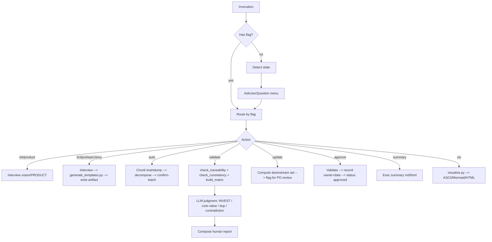

# cleanmatic:product-spec

Product-Owner-facing skill for building and maintaining a strictly-traceable spec hierarchy: **Vision → 1 BRD → many
PRDs → Epics → Stories (+AC)**. Drives a phased PO interview (bilingual EN/VI), persists artifacts as markdown with rich
YAML frontmatter under `docs/product/`, validates structure deterministically and judgment via LLM, and visualizes the
spec tree in ASCII, Mermaid, and self-contained HTML.

> 📘 **End-user guide (non-technical PO):** [`GUIDE-VI.md`](./GUIDE-VI.md) (Tiếng Việt) / [`GUIDE-EN.md`](./GUIDE-EN.md)
> (English) — every use case as a full sample conversation, covering both the natural-language way (preferred) and the
> flag-equivalent, with worked examples from the `examples/acme-shop` sample. Point the PO here first.

## When to Use

- A product owner needs to capture a new product (vision → stories) without writing code.
- An existing spec needs a new BRD/PRD/Epic/Story, delta update, sign-off, or summary.
- A PO has a brain-dump that needs decomposing into the canonical hierarchy.
- A spec needs validation (orphans, missing AC, INVEST quality, core-value drift, contradiction).
- A spec needs visualizing (traceability tree, roadmap, MoSCoW, gap-analysis, …).

## Flags

| Flag                       | Purpose                                                                                                                                                                                                                                                                                                                                                                                     |
|----------------------------|---------------------------------------------------------------------------------------------------------------------------------------------------------------------------------------------------------------------------------------------------------------------------------------------------------------------------------------------------------------------------------------------|
| (no flag)                  | Detect state → present menu (init / new BRD / new PRD / add stories / validate / update / visualize / approve / summary).                                                                                                                                                                                                                                                                   |
| `--product`                | Init/refresh PRODUCT.md (thin product-context labels).                                                                                                                                                                                                                                                                                                                                      |
| `--brd`                    | Create/refine the single BRD.                                                                                                                                                                                                                                                                                                                                                               |
| `--prd [feature]`          | Create/refine a PRD (feature-area). Multi-PRD supported.                                                                                                                                                                                                                                                                                                                                    |
| `--epic [prd]`             | Create/refine an epic under the given PRD.                                                                                                                                                                                                                                                                                                                                                  |
| `--story [epic]`           | Create/refine a story under the given epic.                                                                                                                                                                                                                                                                                                                                                 |
| `--auto`                   | Brain-dump → decompose into BRD goals / PRDs / epics / stories; confirm-batch on ambiguous splits.                                                                                                                                                                                                                                                                                          |
| `--discover <path(s)>` | Discovery seed: ingest raw upstream text (transcripts/notes — files+dirs, `.md`/`.txt`, read-fenced, size-capped) → **candidate** personas/problems/JTBD to seed the Vision/BRD interview. Never auto-commits — the interview confirms each. · *When:* cold-start from raw inputs. · see `references/workflow-discover.md`. |
| `--validate`               | Run structural scripts → layer LLM judgment → human report.                                                                                                                                                                                                                                                                                                                                 |
| `--strict`                 | With `--validate`: errors block; warns do not.                                                                                                                                                                                                                                                                                                                                              |
| `--summary [--audience exec\|release-notes]` | 1-page audience brief FROM the spec: `exec` one-pager (default) or `release-notes` delta (from the audit trail). Same source-of-truth + render path — **no new top-level flag**. · *When:* hand a brief to a stakeholder. · see `references/workflow-summary.md`. |
| `--approve`                | Validate → warn-not-block → record owner+date → flip `status: approved`.                                                                                                                                                                                                                                                                                                                    |
| `--update`                 | Delta-update: ask what changed → compute affected downstream set → flag for PO review (never auto-rewrite prose) → append change-log.                                                                                                                                                                                                                                                       |
| `--decision [list\|ID]` | Decision Register: view or record an explicit PO ruling (`DEC-<n>`) in `decisions.md`; authoritative home for ruled drift (`po_ruling_ref`). · *When:* log a call you've made. · GATE:NO-SILENT-REVERSAL · see `references/workflow-decision.md`. |
| `--learn` | Learn from reality (post-launch): *outcomes* (target vs actual → `OUT-<n>` via `record_outcome.py`) or *feedback* (raw files → candidate problems → `--update`). A `miss` on an approved goal is surfaced, never auto-edited. · *When:* capture what shipped vs planned. · GATE:NO-SILENT-REVERSAL · see `references/workflow-learn.md`. |
| `--apply-critique <report>`| Walk a `product-spec-critique` report finding-by-finding (Keep / Change+re-approve / Defer), one `DEC-<n>` per resolved finding; report read-fenced, prose never auto-rewritten, resumable + injection-safe. · *When:* act on a critique. · GATE:NO-SILENT-REVERSAL · see `references/workflow-apply-critique.md`. |
| `--status` | Spec-health nudge: report last-validated errors/warns + a soft drift reminder when the spec drifted since. Read-only. · *When:* "is my spec still ok / has it drifted?" · see `references/workflow-status.md`. |
| `--viz <view>` | Render a visualization. Graph views (`tree`/`heatmap`/`scope`/`roadmap`/`persona`/`gap`/`moscow`/`time`/`delta` → ascii; `risk`/`competition`/`dashboard` → html-native), body viewers (`board`/`explorer`), governance (`audit`), learning views (`scorecard`/`insight-gap`/`outcome-trend`/`learning-map`/`learning`). · *When:* "show me / a picture of" the spec. · see `references/visualization-spec.md` (learning views: `workflow-learn.md`). |
| `--format <fmt>` | Visualization format: `ascii` · `mermaid` · `html`. Default is **per-view** (see the matrix); ASCII is downgraded, never removed. · *When:* pick a view's render format. · see `references/visualization-spec.md`. |
| `--group-by <field>`       | `--viz board` column grouping: `status` (default) · `horizon` · `moscow`.                                                                                                                                                                                                                                                                                                                   |
| `--filter-wont` | Hide deferred items (`moscow: wont` / `scope: out`) from `tree`/`roadmap`/`time`/`persona`/`board`/`explorer`. Default keeps them visible (marker) — nothing silently dropped. · *When:* declutter a view. · see `references/visualization-spec.md`. |
| `--export <all\|ID\|list>` | read-once Export: assemble a spec slice into ONE self-contained doc under `exports/`. Pairs with `--layers`/`--depth`/`--compact-mode`/`--format`. · *When:* one shareable offline doc. · see `references/workflow-export.md`. |
| `--layers <types>` | Filter artifact types: `--export` buckets `vision,brd,prd,epic,story`; `--viz board/explorer` by type `goal,prd,epic,story`. Unknown token → **rejected** (non-zero), never silently dropped. · *When:* scope an export/board. · see `references/workflow-export.md` + `visualization-spec.md`. |
| `--depth <preset>`         | `--export` verbosity: `context` (default) · `full` · `brief`.                                                                                                                                                                                                                                                                                                                               |
| `--compact-mode <m>` | `--export` compaction: `struct` (default, deterministic) · `llm` (emits `<!-- COMPACT -->` markers; **requires `--format md`**, rejected with `html`). · *When:* summarize export sections. · see `references/workflow-export.md`. |
| `--lang <code>` | Interview/output language: `en` (default) · `vi`. IDs + frontmatter keys stay English; labels/headings/facets localize. · *When:* switch working language. · see `references/workflow-lang.md`. |
| `--voice` | Record the PO's voice into `.memory/po-style.yaml` deterministically (`--register`/`--vocabulary`/`--recurring-asks`/`--do`/`--dont`, lang-keyed) — one writer home (`record_po_style`). · *When:* persist a wording preference. · see `references/behavioral-memory.md`. |
| `preferences.py --set KEY=VALUE` | Write a PO preference deterministically (repeatable; **load→merge→save**, bad enum exits non-zero writing nothing). Persists the engagement knobs `interview_rigor` + `action_prompting` (default `standard`). · *When:* change a standing engagement setting. · see `references/workflow-interview.md` → *Engagement profile*. |
| `--reflect` | Retroactive memory harvest: scan git + `.memory/` (degrade-safe), spawn the read-only opus harvester, propose unrecorded `DEC-<n>`/self-corrections/voice for PO confirm-then-persist. · *When:* recover skipped forcing-functions. · see `references/workflow-reflect.md`. |

## No-Flag Menu

When invoked without a flag, the skill inspects `docs/product/`:

- No `PRODUCT.md` → offer **Init product** (guided vision interview → write PRODUCT.md + vision.md), or **Discover-seed** (point at raw transcripts/notes → candidate personas/problems to seed the interview).
- `PRODUCT.md` exists → present **AskUserQuestion** menu:
  1. New BRD / refine BRD
  2. New PRD (feature-area)
  3. Add stories under existing epic
  4. Validate spec (structural + judgment)
  5. Update (delta — flag affected nodes for review)
  6. Visualize (pick view + format)
  7. Approve (sign-off)
  8. Summary (1-page exec summary)
  9. Apply a critique (walk a `product-spec-critique` report finding-by-finding → record decisions)
  10. Learn from reality / Học từ thực tế (record outcomes vs goals, or feed back real-world feedback)

## Output Contract (in the user's project)

All PO artifacts live under `docs/product/`. The skill never writes prose outside this tree.

```
docs/product/
├── PRODUCT.md                # thin product-context labels (DRY home for facts)
├── vision.md                 # narrative vision + personas + north-star (horizon lives in PRODUCT.md)
├── brd.md                    # single BRD (business goals + metrics + stakeholders)
├── prds/<slug>.md            # one PRD per feature-area
├── epics/<id>.md             # epics referenced from PRDs
├── stories/<id>.md           # stories referenced from epics, with AC
├── exec-summary.md           # generated 1-page summary
├── .session.md               # interview session state (committed; resumable)
├── change-log.md             # append-only delta log
├── decisions.md              # Decision Register: DEC-<n> rulings (authoritative home for ruled drift)
├── outcomes.md               # Outcome Register: OUT-<n> measured outcomes vs BRD goals (--learn)
├── exports/                  # read-once Export docs (<stem>-<ts>-<hash8>.md|html)
├── impact/                   # impact-pass reports (<ts>.md — per-change downstream propagation)
└── visuals/                  # rendered visualizations (ASCII / Mermaid / HTML; incl. board & explorer)
    └── .snapshots/           # graph-snapshot JSONs for delta/diff
```

All HTML outputs — the graph views + `risk`/`competition`/`dashboard` + `board` + `explorer` + `--export --format html` — share **one design
system** — a single head partial with theme toggle, palette, typography, and print-CSS. Bodies render through one client
chokepoint (`DOMPurify.sanitize(marked.parse(md))`, both vendored + inlined) and **fail closed** to escaped text if the
libs are missing.

## Workflow Map



## Loads `references/*` on Demand

The lean skeleton above stays under ~300 lines; full prose lives in `references/`:

- `references/frontmatter-and-id-spec.md` — canonical YAML schema per artifact + parent-scoped ID grammar (`BRD-G1`,
  `PRD-AUTH`, `PRD-AUTH-E1`, `PRD-AUTH-E1-S1`).
- `references/document-model-and-hierarchy.md` — artifact roles, DRY rule, hierarchy diagram, content-ownership table.
- `references/validation-rules-spec.md` — check catalog (script vs LLM), severities, findings JSON schema, `--strict`
  gate.
- `references/visualization-spec.md` — views × formats (12 graph + `board`/`explorer`), graph-JSON shape, flag mapping,
  the shared HTML design system.
- `references/workflow-export.md` — read-once Export: selection model (`--export` + `--layers`), depth presets,
  `--compact-mode llm` workflow, output naming.
- `references/interview-vision.md`, `interview-brd.md`, `interview-prd.md`, `interview-epic.md`, `interview-story.md`,
  `interview-frameworks.md` — bilingual EN/VI question banks + 5-Why / MoSCoW / story-mapping prompts. `--epic` loads
  `interview-epic.md`; `--story` loads `interview-story.md` (progressive disclosure — load only the one the flag needs).
- `references/workflow-interview.md`, `workflow-validate.md`, `workflow-auto.md`, `workflow-update.md`,
  `workflow-status.md`, `workflow-learn.md`, `workflow-discover.md`, `workflow-reflect.md`,
  `workflow-apply-critique.md`, `workflow-summary.md`, `workflow-decision.md`, `workflow-lang.md` — end-to-end
  workflows the LLM executes (deep prose), loaded by the firing flag: `--auto`→`workflow-auto.md`;
  `--update`→`workflow-update.md`; `--status`→`workflow-status.md`; `--learn`→`workflow-learn.md`;
  `--discover`→`workflow-discover.md`; `--reflect`→`workflow-reflect.md`;
  `--apply-critique`→`workflow-apply-critique.md`; `--summary`→`workflow-summary.md`;
  `--decision`→`workflow-decision.md`; `--lang`→`workflow-lang.md`;
  `preferences.py --set`→`workflow-interview.md` (*Engagement profile*).
- `references/behavioral-memory.md` — loaded transitively: the interview and validate final-writer hooks
  (`workflow-interview.md`, `workflow-validate.md`) point at it for the self-correction store's spec + privacy posture.

Load only the references relevant to the active flag. Skill resources (`scripts/`, `assets/templates/`,
`assets/vendor/`) sit alongside.

## Resources

- `scripts/` — Python (stdlib + pyyaml). Run via repo venv `./.claude/skills/.venv/bin/python3`. Each script accepts
  `--root <project-dir>` (default CWD) and emits JSON. All judgment lives in the LLM layer; scripts are structural-only.

> ⚙️ **Venv bootstrap (first run):** before invoking any script, check the shared interpreter exists
> (`./.claude/skills/.venv/bin/python3` on POSIX, `.claude\skills\.venv\Scripts\python.exe` on Windows). If it is
> **missing**, do NOT silently fail or fall back to system Python — pause and ask the user via **AskUserQuestion** to
> confirm running the installer (`./install.sh` POSIX / `install.ps1 -ExecutionPolicy Bypass` Windows, both idempotent).
> Run it only on approval, then retry the script.

> 🪝 **Opt-in memory Stop hook:** `./install.sh --memory-hook` registers the Tier-1 memory-write reminder into
> `.claude/settings.local.json` (gitignored; `--memory-hook-shared` targets the committed `settings.json`). It is
> **opt-in only and never auto-registered** — a plain `./install.sh` does not touch hooks. Full posture + per-signal
> policy: `references/memory-enforcement.md`.
- `assets/templates/` — markdown templates with `{{token}}` substitution, the shared `_viewer-head.html` design-system
  partial, and the export/board/explorer HTML shells.
- `assets/vendor/` — vendored JS for self-contained offline HTML: `mermaid.min.js` (graph views) + `marked.min.js` +
  `purify.min.js` (body-render sanitize chokepoint). All committed; pinned + SHA-verified by the installer.
- `eval/evals.json` — scenario evals (init / auto / validate / delta+viz).
- `examples/` — worked sample product spec.

## Operating Principles

- **PO-facing.** No code in prose. No engineering jargon. Personas, value, scope, AC — in plain language.
- **Frontmatter is source-of-truth.** Scripts parse YAML; the LLM never infers structure from headings.
- **DRY.** One authoritative home per fact. Cross-reference by ID; do not duplicate prose.
- **Script vs LLM split.** Scripts: structural-only (parse, graph, orphan, AC-count, ID integrity). LLM: judgment
  (INVEST, vagueness, core-value drift, dup, contradiction).
- **No silent reversals.** A contradiction with an approved decision is surfaced; the PO chooses keep / change /
  hybrid — the skill never auto-flips.
- **Never overwrite manual prose.** Delta-update flags affected downstream nodes for review; regeneration is opt-in per
  node.
- **Bilingual.** EN and VI interview banks; IDs and frontmatter keys stay English. VI phrasing is native-reviewed
  for natural wording.

Deeper LLM operating guidance lives in `references/` (loaded on demand by flag) and in the repo-root `CLAUDE.md`
(auto-loaded by Claude Code).
