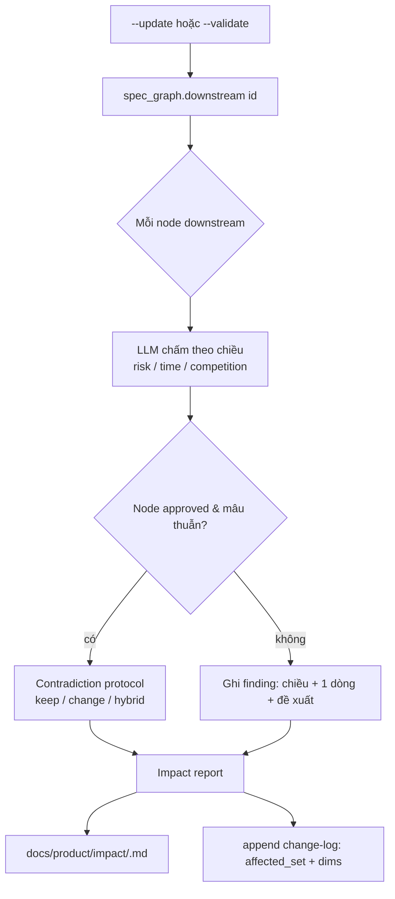
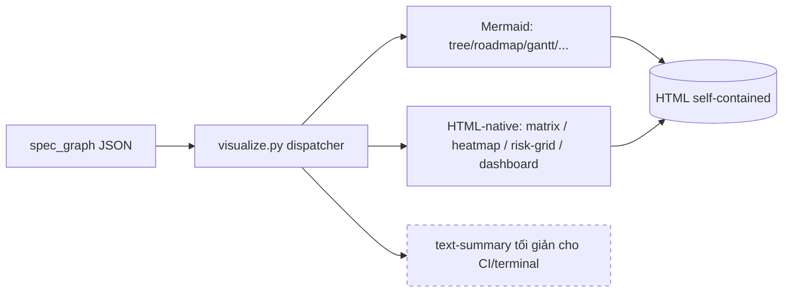

# Brainstorm + Research — product-spec UC3: Nhất quán & Tác động đa chiều

- **Ngày:** 2026-05-30
- **Skill mục tiêu:** `cleanmatic:product-spec` (repo này, `.claude/skills/product-spec/`)
- **Loại:** Báo cáo research + design (CHƯA code). Đầu vào cho `/ck:plan` nếu PO duyệt.
- **Nguồn quyết định:** phỏng vấn 67 câu (Q1–Q67), 17 batch. Mọi phát hiện codebase có dẫn `file:line`.
- **Khẩu vị PO chốt (Q4):** "vừa" — NHƯNG xem §4 (scope đã drift sang đại tu).

---

## 0. Cập nhật quyết định PO — 2026-05-30 (AUTHORITATIVE — ghi đè các mục liên quan)

Phản hồi review của PO. **Ưu tiên cao nhất; ghi đè** các điểm tương ứng bên dưới. 4 câu hỏi mở §12 đã chốt + 2 trade-off trọng yếu.

### 0.1 Hai trade-off cần cẩn trọng cao độ

**(T1) `depends_on` (Phase 2) → rủi ro vòng lặp phụ thuộc (circular dependency).** Thêm edge mới `depends_on: [ID]` cho phép chu trình A→B→C→A.
- Grounded: `_closure()` (`spec_graph.py:226-237`) ĐÃ chống treo nhờ set `out` (`if n in out: continue`) → `downstream()` không infinite-loop kể cả có cycle. **NHƯNG:**
  - Chu trình `depends_on` **vô nghĩa về sản phẩm** → phải **phát hiện & flag `error`**, không im lặng chấp nhận.
  - Renderer MỚI đi theo edge `depends_on` (time-order, dashboard) phải **cycle-safe** (visited-set), nếu không treo khi vẽ.
- **Bắt buộc (điều kiện tiên quyết Phase 2):** thêm check `dep_cycle` (error) bằng DFS 3-màu (white/gray/black) hoặc Kahn topo-sort; renderer dùng visited-set.

**(T2) LLM cho check trừu tượng (`time_realism`, `competitive_drift`) → rủi ro ảo giác.** "Phi thực tế" / "mất lợi thế" là cảm quan → LLM dễ cảnh báo sai nếu thiếu hệ quy chiếu.
- **Bắt buộc khử ảo giác — nạp mỏ neo có cấu trúc, KHÔNG hỏi LLM "cảm nhận":**
  - `time_realism`: đưa `size`(S/M/L) + số story con + `horizon` + khoảng tới `target_date`; định nghĩa cụ thể "phi thực tế" (vd epic `size: L`, ≥6 story, `horizon: now`, target_date < 3 tuần).
  - `competitive_drift`: neo vào enum `competitive_parity` thực tế (vd PRD `scope: core-value` mà parity toàn `behind` → drift). Không phán bằng vibes.
  - **Mặc định bảo thủ:** không chắc → KHÔNG flag. Finding phải **trích dẫn data point** đã dùng.

### 0.2 Quyết định 4 câu hỏi mở (§12)

1. **ASCII → KHÔNG xóa sạch (ĐẢO Q36).** Giá trị lớn nhất vs Jira/Confluence = chạy & hiển thị thẳng trong terminal (zero-dep); xóa ASCII = giết văn hóa CLI. **Chốt:** HTML-native = **default mới**; ASCII **deprecate dần** HOẶC hạ thành **"text-summary tree" siêu tối giản** (vẫn thấy cấu trúc trên terminal). → Phase 4 đổi "xóa" → "hạ cấp"; **không còn breaking lớn**; risk ASCII hạ CAO→THẤP.
2. **Version → chấp nhận Major 2.0.0.** Thay đổi frontmatter quá lớn (target_date, risks enum, parity…); 2.0.0 báo rõ schema dữ liệu nâng cấp.
3. **Q25 warn-nếu-thiếu → ĐỒNG Ý chỉ ở PRD + Epic.** Ép khai risk/time per-story = micromanagement + nhiễu → PO bỏ qua mọi cảnh báo. Story: **silent**.
4. **URL đối thủ → rủi ro OpSec.** Không lưu URL nội bộ/tài liệu mật vào repo. Luật nhỏ: script **bỏ qua** URL có tiền tố `private:`; khuyến khích PO chỉ để URL public (trang chủ/bài báo công khai).

---

## 1. Tóm tắt điều hành

UC3 gộp **2 vấn đề tách biệt**:
- **(A) Nhất quán + lan truyền** — "đổi 1 doc thì doc nào ảnh hưởng". **Đã giải quyết** sẵn bằng `downstream()` (`spec_graph.py:251`) + `--update` + `--validate`.
- **(B) Đánh giá tác động đa chiều** — rủi ro / thời gian / chi phí / cạnh tranh. **Chưa**; chỉ `risk` có "nhà cấu trúc" (nửa vời).

PO chọn làm **cả hai** (Q2), thêm cấu trúc cho **RISK (hoàn thiện) + TIME + COMPETITION**; **COST = chỉ dùng `size` S/M/L proxy** (Q6, không chống non-goal). Bổ sung **impact-engine** chạy ở cả `--update` và `--validate`, và **hạ cấp ASCII** (PO §0.2 đảo Q36 — HTML-native = default mới + ASCII text-summary tree, KHÔNG breaking lớn; xem §4 + §10).

**Khuyến nghị cốt lõi:** triển khai **phân pha** `risk → time → competition → ASCII-removal` (Q58). Phase 1 (risk) là quick-win đóng đúng bug grounded; các phase sau cần PO chấp nhận scope = major `2.0.0`.

---

## 2. Bối cảnh & phát hiện codebase (grounded)

| # | Phát hiện | Vị trí |
|---|-----------|--------|
| 1 | `downstream(id)` = bao đóng bắc cầu node con — động cơ lan truyền, **không trọng số** | `spec_graph.py:251-253` |
| 2 | Luật **Script=structural / LLM=judgment** bất di bất dịch | `validation-rules-spec.md:6-12` |
| 3 | **RISK nối nửa vời**: `epic.md:21` có `risks:` frontmatter; **`prd.md` KHÔNG** → `--viz risk` chỉ thấy risk epic | `epic.md:21`, `prd.md:6-21` |
| 4 | `impact/likelihood` (low/med/high) **không enum-validate** → typo lọt | `check_consistency.py:39-46`, `spec_graph.py:214-223` |
| 5 | COST không tồn tại; TIME chỉ `horizon`+`size` (enum đóng) | `check_consistency.py:39-46` |
| 6 | COMPETITION chỉ prose `## Market Context` | `brd.md:53-55` |
| 7 | Skill **chủ động không làm cost/estimation** | `frontmatter-and-id-spec.md:237-241` |
| 8 | View cắm sạch qua `VIEWS` tuple; field mới chạm ~5-7 file | `visualize.py:39`, `spec_graph.py:82-101` |
| 9 | ASCII là default zero-dep cho 11 view; có test assert text ASCII | `visualize.py:219`, `test_visualize.py` |
| 10 | Mermaid **không** biểu đạt sạch matrix/heatmap → hiện fallback ASCII-in-pre | `visualization-spec.md:42-47` |

---

## 3. Bảng quyết định (Q1–Q67)

### Khung
- Q1 Đầu ra = **Báo cáo research+design (chưa code)**
- Q2 Trọng tâm = **cả A (nhất quán) + B (đa chiều)**
- Q3 Người dùng = **cả PO non-tech + PO kỹ thuật** → thiết kế 2 tầng (mặc định đơn giản, nâng cao opt-in)
- Q4 Khẩu vị = **vừa** (⚠ thực tế drift → §4)

### Phạm vi chiều
- Q5 = **RISK (hoàn thiện) + TIME + COMPETITION**
- Q6 COST = **size S/M/L proxy** (không thêm cấu trúc cost)
- Q7 Lan truyền = **downstream()+LLM diễn giải VÀ impact-report pass**

### RISK
- Q8 field = `{description, impact, likelihood}` **+ mitigation + status(open/mitigated/accepted)**
- Q9 thang = **giữ low/med/high**
- Q10 vị trí = **Epic + PRD** (nối `risks:` vào `prd.md`)
- Q11 trend = **có — tận dụng `.snapshots/` + `--viz delta`**

### TIME
- Q12 model = **`target_date` đơn (ISO) / artifact**
- Q13 vị trí = **PRD + Epic**
- Q14 deps = **dùng dependencies để cảnh báo thứ tự** → Q64: **cấu trúc hóa deps thành `depends_on: [ID]`**
- Q15 cảnh báo = **con trễ hơn cha (deterministic, trong check) + quá hạn so today (Q52: script riêng `--today`)**

### COMPETITION
- Q16 dạng = **feature-parity matrix**
- Q17 vị trí = **đối thủ định nghĩa ở BRD + PRD tham chiếu**
- Q18 = **LLM phán đoán competitive impact**
- Q19 nguồn = **PO nhập tay + lưu link (không auto-fetch)**
- Q48 feature key = **theo PRD = feature-area** (matrix = đối thủ × PRD)
- Q49 schema đối thủ = **name + url + threat-level** (ở BRD)
- Q50 ô parity = enum **ahead / parity / behind / none** (khai ở PRD)

### Impact-engine
- Q20 output = **change-log + file riêng** (Q61: `docs/product/impact/<ts>.md`)
- Q21 chi tiết = **chiều bị chạm + 1 dòng LLM + đề xuất hành động**
- Q22 approved = **flag + contradiction protocol nếu mâu thuẫn**
- Q23 trigger = **cả `--update` và `--validate`**
- Q62 change-log = **thêm `affected_set` + `dims`**

### Validation / gating
- Q24 gate = **chỉ warn, không chặn** (lỗi cấu trúc/enum mới block)
- Q25 thiếu data = **warn CHỈ ở PRD + Epic** (story silent — §0.2; tránh micromanagement/nhiễu)
- Q26 LLM checks = **`risk_blindspot` + `time_realism` + `competitive_drift`**
- Q27/Q53 ngưỡng = **>50% risk high → warn**
- Q54 blindspot = **≥5 story mà 0 risk → warn**
- Q55 ngưỡng = **hằng số module có comment** (như `PERSONA_SOFT_CAP`)
- Q52 overdue = **script riêng nhận `--today`** (không-test, giữ determinism)

### Visualization
- Q28 = **per-dim views + 1 dashboard** (Q65: dashboard **HTML-only**)
- Q29 time view = **mở rộng roadmap + cột deadline**; Q47 Mermaid = **gantt**
- Q30 comp view = **parity matrix table + threat heatmap**
- Q31 format = **HTML + Mermaid** (Q36: **bỏ ASCII**)
- Q44 matrix/heatmap/risk-grid = **HTML-native table** (Mermaid không sạch)
- Q45 board/explorer = **HTML-only, bỏ fallback ascii**
- Q46 CI/terminal = **giữ text-summary tối giản** (không phải graph ASCII)

### Workflow
- Q32 interview = **theo tầng** (time/risk ở PRD+Epic, competition ở BRD)
- Q33 = **tùy chọn, có gợi ý**
- Q34 `--auto` = **suy chiều mới + confirm-batch**
- Q35 `--summary` = **thêm time + competition**

### Ràng buộc & rollout
- Q36 ASCII = ~~bỏ toàn skill~~ → **PO override §0.2: KHÔNG xóa; HTML-native default mới + ASCII hạ thành text-summary tree tối giản**
- Q37 = **Script/LLM split tuyệt đối**
- Q38/Q56/Q57/Q60 migration = **script; auto draft/review + backup; approved xác nhận từng cái; ghi placeholder rỗng**
- Q39 = **bilingual EN/VI**
- Q40 report = **đầy đủ + sơ đồ**
- Q41 = **phác eval mỗi chiều**
- Q42 = **migrate acme-shop**
- Q43 version = **major → 2.0.0**
- Q59 deal-breakers = **truy vết+ID, back-compat, no-auto-edit-approved, determinism** (cả 4)
- Q63/Q66 research = **risk-matrix + feature-parity/battlecard + RICE/WSJF — prior-art reference only** (không thêm score vào skill)
- Q67 = **đủ — viết báo cáo**

---

## 4. ⚠ Scope reality check (brutal honesty)

Q4 = "vừa". Nhưng tổng quyết định = **đại tu thực sự**:

| Khối | Lý do là "lớn" |
|------|----------------|
| ~~Bỏ ASCII toàn skill~~ → **hạ cấp ASCII (PO §0.2)** | HTML-native = default mới; ASCII GIỮ ở dạng text-summary tree tối giản. **Không còn breaking lớn**; `test_visualize.py` chỉ chỉnh phần graph-art bỏ, giữ test tree-text. Bảo toàn giá trị "zero-dep/terminal-safe" |
| Cấu trúc hóa `depends_on` (Q64) | Thêm **loại edge mới** vào graph → chạm `build_edges`, traceability, dangling-link, ID-resolution |
| 3 chiều + impact-engine + migration + dashboard + 3 LLM check + thresholds | Mỗi chiều ~5-7 file; impact-engine + migration là 2 workstream riêng |

**Mâu thuẫn nội tại đã xuất hiện & đã hòa giải:** Q56 ("chạm tất cả") × Q59 ("no-auto-edit-approved") → Q60 chốt: auto draft/review + backup, approved xác nhận từng cái. ✅

**Khuyến nghị (đã chốt §0):** chấp nhận `2.0.0` major, làm **phân pha** (§11). PO đã hạ rủi ro lớn nhất: (a) **không xóa ASCII** mà hạ cấp → HTML-native default + ASCII text-summary tree (§0.2); (b) **giữ `depends_on`** nhưng **bắt buộc** check `dep_cycle` chống vòng lặp (§0.1 T1). Hai điều chỉnh này cắt phần lớn rủi ro mà vẫn đạt trọn UC3.

---

## 5. Kiến trúc đề xuất

### 5.1 Mô hình dữ liệu (frontmatter mới)

```yaml
# PRD (prds/<slug>.md) — thêm:
risks:                          # NỐI MỚI vào prd.md (đóng bug grounded #3)
  - description: "Phụ thuộc OAuth bên thứ ba"
    impact: high                # enum low|med|high (Q9) — ENUM-VALIDATE MỚI (bug #4)
    likelihood: med
    mitigation: "Có nhà cung cấp dự phòng"   # Q8 mới
    status: open                # enum open|mitigated|accepted (Q8 mới)
target_date: 2026-09-30         # Q12 — ISO, optional
depends_on: [PRD-BILLING]       # Q64 — list ID, edge mới
competitive_parity:             # Q17/Q50 — PRD khai vs đối thủ (định nghĩa ở BRD)
  COMP-ACME: behind             # enum ahead|parity|behind|none
  COMP-SHOPIFY: parity

# Epic (epics/<id>.md) — thêm: risks (đã có) + target_date + depends_on

# BRD (brd.md) — thêm khối đối thủ:
competitors:                    # Q49
  - id: COMP-ACME
    name: "Acme Commerce"
    url: "https://acme.example"   # Q19 — chỉ lưu, KHÔNG fetch
    threat: high                # enum low|med|high
```

### 5.2 Sơ đồ luồng impact-engine (Q40 yêu cầu sơ đồ)



### 5.3 Render architecture (HTML-native default; ASCII hạ thành text-summary tree — KHÔNG xóa, §0.2)



- **Mermaid**: tree, roadmap, time-gantt, gap, delta… (các view có Mermaid form sạch).
- **HTML-native** (không Mermaid): parity matrix, threat heatmap, risk 3×3 grid, dashboard đa chiều.
- **text-summary** (Q46): thay graph-ASCII cũ — vài dòng đếm node/finding cho terminal/CI; **không** phải tree ASCII.

### 5.4 Impact-engine vs Validation-catalog (làm rõ — tránh nhầm)

- **Validation-catalog checks** (Q26: `risk_blindspot`, `time_realism`, `competitive_drift`) = chất lượng **per-artifact**, chạy trong `--validate`.
- **Impact-pass** (Q20-23) = lan truyền **per-change**, chạy trong `--update` + `--validate`, dùng `downstream()` + LLM diễn giải.
- Hai cái độc lập; cùng tầng LLM (Q37 giữ script thuần cấu trúc).

---

## 6. Ba hướng tiếp cận (approaches)

### Hướng A — Phased minimal (chỉ Phase 1 risk)
- Chỉ đóng bug grounded #3 #4: nối `risks:` vào `prd.md` + enum-validate impact/likelihood + thêm mitigation/status.
- **Pros:** đúng "vừa"/quick-win; không chống nguyên tắc; ~3-4 file; không breaking.
- **Cons:** không đạt B đầy đủ (time/competition vẫn prose).

### Hướng B — Full multi-dim phân pha ✅ (KHUYẾN NGHỊ)
- Toàn bộ quyết định Q1-Q67, nhưng **làm theo 4 phase** (§11). ASCII-removal là phase cuối.
- **Pros:** đạt trọn UC3; mỗi phase ship độc lập, có eval; rủi ro chia nhỏ.
- **Cons:** tổng = `2.0.0` major; phase 4 (ASCII) breaking.

### Hướng C — Tách skill `impact` riêng
- product-spec giữ nguyên; skill mới đọc graph JSON, lo đa chiều + impact-engine.
- **Pros:** product-spec không phình; ranh giới sạch.
- **Cons:** trùng dữ liệu graph; 2 skill phải đồng bộ schema; lệch DRY; PO phải học 2 surface. Q67 PO **không** chọn tách → loại.

**Chọn: Hướng B, phân pha.**

---

## 7. Bản đồ file bị động (file-touch map)

| Workstream | File chạm | Loại |
|------------|-----------|------|
| **P1 Risk** | `prd.md` (+risks frontmatter), `epic.md` (+mitigation/status), `check_consistency.py` (ENUMS risk impact/likelihood/status; `risk_blindspot` ngưỡng const; risk-high% const), `spec_graph.py` (`_risks` đã có — thêm mitigation/status passthrough), `render_html.py` (risk 3×3 HTML-native), `generate_templates.py` (LIST_FIELDS đã có risks) | sửa |
| **P2 Time** | `prd.md`/`epic.md` (+target_date,+depends_on), `spec_graph.py` (`_node_from_artifact`+fields; `build_edges` thêm kind `depends_on`; snapshot+target_date), `check_consistency.py` (con-trễ-hơn-cha; depends_on dangling), `check_traceability.py` (depends_on edge), **mới** `time_advisory.py` (`--today`), `render_mermaid.py` (gantt), `render_html.py` (roadmap+deadline col), `i18n_labels.py` | sửa + 1 mới |
| **P3 Competition** | `brd.md` (+competitors), `prd.md` (+competitive_parity), `spec_graph.py` (parse competitors; snapshot+parity), `check_consistency.py` (enum threat/parity; shape), `render_html.py` (parity matrix + threat heatmap HTML-native), `i18n_labels.py` | sửa |
| **Impact-engine** | `workflow-auto-and-update.md` + `workflow-validate.md` (impact-pass), `change-log-entry.md` (+affected_set,+dims), **mới** `docs/product/impact/` output, render cho impact report | sửa + dir mới |
| **Dashboard** | `visualize.py` (VIEWS+`time`,`competition`,`dashboard`), `render_html.py` (dashboard HTML-only) | sửa |
| **P4 ASCII removal** ⚠ | **xóa/gut** `render_ascii.py`; viết lại `test_visualize.py`; `visualize.py` (bỏ ascii dispatch, text-summary); `render_board.py`/`render_explorer.py` (bỏ ascii fallback); viết lại `visualization-spec.md`; sửa `SKILL.md`/`CLAUDE.md` | breaking |
| **Migration** | **mới** script `migrate_multidim_fields.py` (auto draft/review + backup; approved confirm-từng-cái; ghi placeholder) | mới |
| **Docs/spec** | `frontmatter-and-id-spec.md`, `validation-rules-spec.md`, `document-model-and-hierarchy.md`, `interview-*.md` (bank câu hỏi mới), `SKILL.md` (flags + version 2.0.0), `CLAUDE.md` | sửa |
| **Example/Eval** | `examples/acme-shop/*` (migrate minh hoạ), `eval/evals.json` + fixtures | sửa |

---

## 8. Eval sketch (Q41 — mỗi chiều 1 scenario)

| Eval | Input | Kỳ vọng |
|------|-------|---------|
| `risk-complete` | PRD có `risks:` với `impact: high` hợp lệ + 1 typo `impact: hihg` | typo → `unknown_enum` error; PRD risk lên `--viz risk` |
| `risk-blindspot` | Epic có 6 story, 0 risk | warn `risk_blindspot` |
| `risk-high-threshold` | 5 risk, 3 ở high (60%) | warn ngưỡng >50% |
| `time-child-late` | Epic `target_date` > PRD cha | warn (deterministic, trong check) |
| `time-overdue` | `time_advisory.py --today 2026-12-01` trên target_date 2026-09 | báo quá hạn (ngoài check) |
| `time-dep-order` | A `depends_on: [B]`, A.target_date < B.target_date | warn thứ tự |
| `competition-parity` | PRD `competitive_parity: {COMP-X: invalid}` | `unknown_enum`; matrix render đối thủ×PRD |
| `competitive-drift` | Feature parity toàn `behind` | LLM warn `competitive_drift` |
| `impact-pass` | Đổi PRD-AUTH, có epic approved downstream | impact report liệt kê node + chiều + đề xuất; approved → contradiction protocol |
| `migration` | Spec cũ + 1 approved | draft/review nhận placeholder + backup; approved chờ confirm |

---

## 9. Bổ sung catalog validation

| Check | Owner | Severity | Trigger |
|-------|-------|----------|---------|
| `unknown_enum` (mở rộng) | script | error | risk.impact/likelihood/status, threat, parity ngoài enum |
| `invalid_type` (reuse, mở rộng) | script | error | risk/competitor sai shape — **dùng lại `invalid_type` sẵn có** (`check_consistency.py:~110`), KHÔNG thêm `invalid_shape` (RT1 F7) |
| `time_child_late` | script | warn | con `target_date` > cha |
| `dep_dangling` | script | error | `depends_on` trỏ ID không tồn tại |
| `dep_cycle` | script | error | chu trình `depends_on` (A→B→…→A); DFS 3-màu / Kahn topo-sort (§0.1 T1) |
| `dep_order` | script | warn | A depends_on B nhưng A sớm hơn B |
| `risk_blindspot` | script | warn | ≥5 story con, 0 risk — đếm thuần deterministic (RT1 F1: KHÔNG phải LLM, giữ Script-vs-LLM split) |
| `risk_high_ratio` | script | warn | >50% risk ở high |
| `time_realism` | LLM | warn | deadline phi thực tế so phạm vi |
| `competitive_drift` | LLM | warn | feature mất lợi thế theo parity |
| `overdue` | script `--today` (ngoài gate) | advisory | target_date < today |

---

## 10. Rủi ro thiết kế & giảm thiểu

| Rủi ro | Mức | Giảm thiểu |
|--------|-----|-----------|
| ~~Bỏ ASCII = breaking~~ → **hạ cấp ASCII** (PO §0.2) | THẤP | Không xóa: HTML-native default mới + ASCII text-summary tree; bảo toàn giá trị zero-dep/terminal; chỉ gut phần graph-art trong `render_ascii.py`, giữ test tree-text |
| **Scope drift "vừa"→major** | CAO | Phân pha; P1 ship độc lập; cho phép cắt P4+depends_on nếu muốn giữ "vừa" |
| `depends_on` thêm edge mới → phức tạp graph | TB | Tách thành sub-phase của P2; test traceability kỹ |
| **(T1) Vòng lặp `depends_on` (A→B→…→A) → renderer treo** | CAO | `_closure` đã guard `downstream()`; NHƯNG **bắt buộc** check `dep_cycle` (error, DFS 3-màu/Kahn) + mọi renderer mới đi theo `depends_on` dùng visited-set (§0.1 T1) |
| **(T2) LLM ảo giác ở `time_realism`/`competitive_drift`** | CAO | Nạp mỏ neo cấu trúc (size+#story+horizon+Δtarget_date; enum parity) + định nghĩa "phi thực tế" cụ thể + mặc định bảo thủ (không chắc=không flag) + finding **bắt buộc trích data point** (§0.1 T2) |
| Q25 "warn nếu thiếu" gây nhiễu | TB | **Đã chốt (§0.2): warn CHỈ ở PRD+Epic; story silent.** Migration placeholder (Q57) làm field hiện diện → ít warn |
| URL đối thủ commit lên git → OpSec | THẤP | **Đã chốt (§0.2):** script **bỏ qua** URL có tiền tố `private:`; khuyến khích chỉ URL public (trang chủ/bài báo); không lưu tài liệu mật |
| Bilingual VI cho enum/nhãn mới | THẤP | `i18n_labels.py` + note native-review pending (như hiện tại) |
| RICE "Effort" kéo về cost | THẤP | Q66: prior-art reference only, KHÔNG thêm score |

---

## 11. Lộ trình đề xuất (next steps)

**Thứ tự (Q58): risk → time → competition → ASCII-removal.**

- **Phase 1 — Risk hardening** (quick-win, không breaking): nối `risks:` vào `prd.md`, enum-validate, +mitigation/status, `risk_blindspot`+ngưỡng, risk-grid HTML-native, eval.
- **Phase 2 — Time**: `target_date` + `depends_on` (edge mới). **Điều kiện tiên quyết (§0.1 T1):** check `dep_cycle` (error, DFS 3-màu/Kahn) + renderer cycle-safe (visited-set) phải làm TRƯỚC khi mở edge mới. + cảnh báo con-trễ-cha + `time_advisory.py --today` + roadmap-deadline/gantt + eval.
- **Phase 3 — Competition**: competitors@BRD + parity@PRD + matrix/heatmap HTML-native + `competitive_drift` + `--summary` + eval.
- **Phase 3.5 — Impact-engine + migration**: impact-pass ở `--update`/`--validate` + `docs/product/impact/` + change-log schema + migration script (approved-confirm).
- **Phase 4 — ASCII hạ cấp** (KHÔNG breaking lớn — §0.2): HTML-native = default mới; **giữ** ASCII dạng text-summary tree tối giản (gut phần graph-art nặng trong `render_ascii.py`, KHÔNG xóa sạch); cập nhật `test_visualize` (giữ test tree-text) + visualization-spec + SKILL/CLAUDE; board/explorer giữ fallback text-summary.
- **Phase 5 — Docs + example**: migrate acme-shop, cập nhật references, bump 2.0.0.

Đề xuất `/ck:plan --tdd` (giải pháp refactor hành vi hiện có + có test_visualize/test_scripts cần khóa trước khi đổi).

---

## 12. Câu hỏi còn mở

**Tất cả đã chốt ở §0 (2026-05-30) — không còn câu hỏi mở:**

1. ~~Bỏ ASCII?~~ → **§0.2:** KHÔNG xóa; HTML-native default + ASCII text-summary tree.
2. ~~"vừa" hay 2.0.0?~~ → **§0.2:** chấp nhận Major **2.0.0**.
3. ~~Q25 thu hẹp?~~ → **§0.2:** warn CHỈ PRD+Epic; story silent.
4. ~~URL nhạy cảm?~~ → **§0.2:** OpSec — script bỏ qua tiền tố `private:`, khuyến khích URL public.

Hai trade-off mới (§0.1) có phương án **bắt buộc**: **(T1)** check `dep_cycle` + renderer visited-set; **(T2)** LLM structured-anchor + trích data point khử ảo giác.
