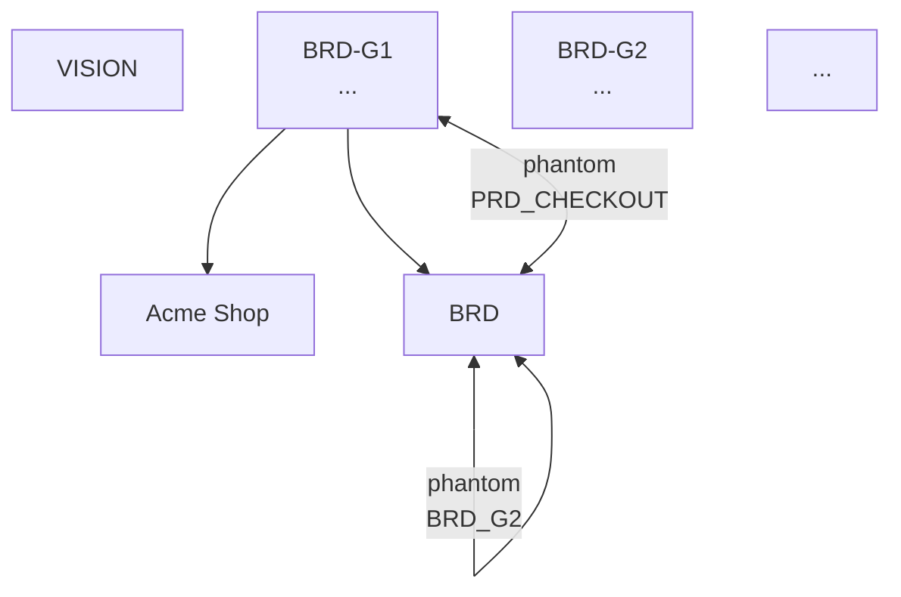

# Hardcore 4-Wave RE-REVIEW — `cleanmatic:product-spec`

## TL;DR

Prior review (260528-1945) flagged 5 CRITICAL + 6 IMPORTANT + 8 MINOR. Remediation (260528-2011) claimed 5 CRIT + 4 HIGH fixed. **All 5 prior CRITs verified fixed** (venv exists, vendor blob 2.57MB self-contained, fixtures populated, HTML dispatch correct, root docs moved). Pytest 32/32 green; worked example clean.

**BUT** this re-review uncovers **3 new IMPORTANT findings** the prior pass missed by not probing the actual rendered output and the `--lang` plumbing:

- **NEW-1 (IMPORTANT):** `--format mermaid` for heatmap/persona/risk returns raw HTML `<pre>...</pre>` — violates the contract "fenced Mermaid block ready to paste into markdown" (visualization-spec.md L11).
- **NEW-2 (IMPORTANT):** Tree Mermaid emits phantom `BRD` node — `BRD_G1 --> BRD` edges declared but `BRD` is never defined as a node. Renders as unlabeled implicit box in the primary HTML tree view. Root cause = vestigial edge in `spec_graph.build_edges:125-126`.
- **NEW-6 (IMPORTANT):** `--lang vi` accepts the flag but localizes **nothing** in ASCII/Mermaid output. render_ascii.py + render_mermaid.py contain zero "lang" references; labels are hardcoded English (`## NOW`, `Must`, etc.). HTML only sets `<html lang="vi">` attribute. Promise in visualization-spec.md L107 (`now/next/later → bây giờ/tiếp/sau`) is silently dropped.

Plus 2 IMPORTANT contract drifts (NEW-4 weak slug validation at generate-time; NEW-9 eval downstream contract gap) and 8 MINOR/OBSERVATIONAL items.

**Verdict:** the build is functionally usable for EN-only structural workflows but ships with silent feature gaps (`--lang vi`) and primary-view cosmetic bugs (phantom BRD). Block-1 of remediation closed the original CRITs; Block-2 needed before v1 ships per the original brainstorm promise of bilingual + offline + clean primary visualization.

| Severity | Count | Block ship? |
|----------|-------|-------------|
| **CRITICAL (new)** | 0 | — |
| **CRITICAL (regression of prior)** | 0 | — |
| **IMPORTANT (new this pass)** | 5 | should fix before v1 |
| **MINOR / OBSERVATIONAL (new + carry-over)** | 10 | acceptable as known limitations |

---

## Wave 1 — Inventory (re-verified)

| Layer | Present | Notes |
|---|---|---|
| Plan phases 1-8 | ✓ all marked Completed | matches |
| SKILL.md | ✓ 133 lines (header line 133 fixed to drop dead CLAUDE.md ref) | OK |
| `references/*` (5 interview + 4 spec + 3 workflow) | ✓ | bilingual EN/VI confirmed in 5 banks |
| Templates | ✓ 9 templates + visual-html-shell.html | OK |
| Scripts | ✓ 11 files | all run via repo venv |
| Pytest tests | ✓ `test_scripts.py` (16) + `test_visualize.py` (16) | **32/32 pass (verified)** |
| Visualization renderers | ✓ ascii + mermaid + html | see NEW-1, NEW-2, NEW-6 |
| Eval scaffold | ✓ evals.json + 4 JSON fixtures + 1 TXT + 2 symlinks | populated; runtime gap (see NEW-9) |
| Worked example | ✓ examples/acme-shop validates clean | verified findings=[] both checkers |
| Root docs | ✓ `/CLAUDE.md` (118 lines) + `/README.md` (104 lines) | auto-loaded per Claude Code mechanics |
| Vendored Mermaid | ✓ `assets/vendor/mermaid.min.js` 2571900 bytes, sha256 `a43bc1afd446f9c4cc66ac5dd45d02e8d65e26fc5344ec0ef787f88d6ddb6f9e`, signature `__esbuild_esm_mermaid` present | self-contained verified |
| Repo venv | ✓ `.claude/skills/.venv/bin/python3 → python3.14`, yaml 6.0.3, pytest 9.0.3 | OK |

**Verified by command (this pass):**
- `.claude/skills/.venv/bin/python3 -m pytest .claude/skills/product-spec/scripts/tests/ -v` → 32 passed in 0.19s
- `check_traceability.py --root .claude/skills/product-spec/examples/acme-shop` → `findings: []`, 7 nodes, 6 edges
- `check_consistency.py --root .claude/skills/product-spec/examples/acme-shop` → `findings: []`
- `visualize.py --view heatmap --format html` writes 2574031-byte HTML with no `cdn.jsdelivr.net`, no `CDN fallback`, contains `__esbuild_esm_mermaid` (vendored signature), wraps body in `<pre>` not `<div class="mermaid">` (CRIT-4 fix landed)
- `bash install-vendor-mermaid.sh` (idempotent) → already-present skip

---

## Wave 2 — Deep dive (deltas vs prior review)

### Fixes from prior remediation — all verified

| Prior CRIT | Status | Evidence (this pass) |
|---|---|---|
| **CRIT-1 venv missing** | ✓ FIXED | `test -e .claude/skills/.venv/bin/python3` passes; Python 3.14.3 |
| **CRIT-2 vendored Mermaid empty** | ✓ FIXED | 2.57MB blob present + sha256 captured; HTML output 2.57MB with `__esbuild_esm_mermaid` and no CDN strings |
| **CRIT-3 eval fixtures absent** | ✓ FIXED | 4 JSON + 1 TXT + 2 symlinks under `eval/fixtures/`; init-answers.json carries all required PRODUCT fields, personas count = 2 |
| **CRIT-4 HTML dispatch for ASCII-fallback views** | ✓ FIXED | `visualize.py:97-102` detects `<pre>` prefix and routes `view_format="pre"`; regression test passes |
| **CRIT-5 CLAUDE.md + README.md in skill folder** | ✓ FIXED | both at repo root; skill-folder copies removed; SKILL.md dead ref dropped |
| **HIGH-2 _escape missing quotes** | ✓ FIXED | render_html.py:72-82 escapes `&<>"'`; comment documents attribute-safety |
| **HIGH-3 mermaid tree dup PRODUCT node** | ✓ FIXED | render_mermaid.py:37 `if n.get("type") == "product": continue` |
| **HIGH-5 generate_templates story --parent weak** | ✓ FIXED | regex `^PRD-[A-Z][A-Z0-9-]{0,15}-E[0-9]+$` rejects PRD-IDs and nested-story-IDs |
| **HIGH-6 frontmatter-and-id-spec.md mis-states allocator** | ✓ FIXED | line 17-18 now matches code (CLI passes `session_used=[]`; `--id` is the batch mechanism) |

### Scripts re-audit

- **Single-responsibility honored.** All scripts under 235 LOC. spec_graph.py 232, generate_templates.py 225, render_ascii.py 192. Acceptable.
- **Script vs LLM split honored.** No semantic judgment leaks into any structural script. Verified by reading all 4 checkers + generator + 3 renderers.
- **`--root` honored.** All 5 main scripts + visualize accept `--root` with sane CWD default.
- **JSON output, always exit 0.** Confirmed for check_traceability, check_consistency, build_traceability_matrix, generate_templates, spec_graph, visualize.

### References re-audit

- **CLAUDE.md (root)** carries the 5 operating principles + ID grammar + script CLI contract. Re-scoped to project-level framing per CRIT-5. 118 lines.
- **README.md (root)** project-level quickstart, flag reference, install/run instructions. 104 lines.
- **5 interview banks** present, all bilingual (verified VI markers in all 5).
- **3 workflow refs** (workflow-interview, workflow-validate, workflow-auto-and-update) populated per Phase 7.
- **4 spec refs** (frontmatter-and-id, document-model, validation-rules, visualization) consistent with code.

---

## Wave 3 — Hardcore (adversarial runtime probes — NEW findings)

### NEW-1 (IMPORTANT) — `--format mermaid` for heatmap/persona/risk returns HTML `<pre>`, not markdown-friendly fenced block

**File:** `scripts/render_mermaid.py:55, 98, 136`
**Contract:** `references/visualization-spec.md:11` — `mermaid` format: "emits a fenced ```mermaid block. Valid v11 syntax." And L43: "the Mermaid output falls back to a text fallback inside a `pre` block."
**Reality:**

```
$ visualize.py --view heatmap --format mermaid
<pre>
| Type    | draft    | review   | approved |
...
</pre>
```

This is **HTML pre tags**, not a markdown-fenced code block. When the PO pastes this into a markdown doc:
- It renders as raw HTML pre (works in HTML-permissive markdown, but not as a Mermaid block).
- It is NOT a "Mermaid block" per the contract — the user asked for `--format mermaid` and got HTML.

**Fix:** for ASCII-fallback views, the `--format mermaid` output should be a fenced markdown code block (` ``` ` not ` ```mermaid `):
```python
def heatmap(graph): return f"```\n{ascii_heatmap(graph)}\n```"
```
Or, more honestly, return the ` ```mermaid `-fenced ASCII inside a comment, e.g. ` ```mermaid\n%% heatmap (ASCII fallback, Mermaid lacks heatmap support)\n... `.
**Severity:** IMPORTANT (contract drift on user-visible output).

### NEW-2 (IMPORTANT) — Phantom `BRD` node in primary tree Mermaid output

**File:** `scripts/spec_graph.py:125-126`, `scripts/render_mermaid.py:tree`
**Trace:**
- `spec_graph.build_edges`: for each goal, emits `{"from": goal_id, "to": "BRD", "kind": "brd"}`.
- BRD itself is **never** added as a node — `build_nodes` expands `brd.md`'s `goals` list into goal nodes but does not emit a BRD container node.
- `render_mermaid.tree` iterates ALL edges, emitting `BRD_G1 --> BRD`. Mermaid then creates an implicit, unlabeled box for `BRD`.

**Evidence (live render of acme-shop tree.html):**


**Impact:** the primary HTML view (the PO's #1 visualization) shows an unlabeled stranded box. Visually broken in the deliverable.

**Fix options (smallest first):**
1. In `render_mermaid.tree`, skip edges where `to == "BRD"` (the goal→BRD link is logically redundant: goals already chain to PRODUCT).
2. OR delete the `goal → BRD` edge from `spec_graph.build_edges` entirely (it has no downstream consumer that I can find — ASCII tree doesn't use it, matrix doesn't, delta doesn't).
3. OR explicitly declare `BRD["..."]` as a node before the loop.

Option 2 is cleanest — removes vestigial state. The `parent: "BRD"` field on goal nodes can remain for documentation.

**Severity:** IMPORTANT (primary user-facing output looks broken).

### NEW-3 (MINOR) — `VISION` node disconnected with empty title

**File:** `scripts/render_mermaid.py:tree`, `scripts/spec_graph.py:_node_from_artifact`
**Symptom:** `VISION["VISION\n"]` in tree Mermaid — node declared, no edges to/from, empty title because `vision.md` frontmatter doesn't carry a `title` or `name` field.

**Fix:** Either (a) skip nodes with no parent edges and not in the explicit "root anchor" set, or (b) read vision title from frontmatter `name`/`title` consistently.
**Severity:** MINOR (cosmetic; doesn't break diagram).

### NEW-4 (IMPORTANT) — Generate-time slug-length validation missing for epic/story

**File:** `scripts/generate_templates.py:84-86, 91-93`
**Repro:**
```
$ generate_templates.py --type epic --parent "PRD-MORE-THAN-SIXTEEN-CHARS"
{"type": "epic", "id": "PRD-MORE-THAN-SIXTEEN-CHARS-E1", ... }
```
Generated ID later fails `check_consistency.invalid_id` because the slug section exceeds 16 chars. Fast-fail at generate would be cleaner — currently the file is written (with `--write`) and only flagged downstream.

**Fix:** validate parent passes `ID_PATTERN_BY_TYPE["prd"]` (for epic creation) and `ID_PATTERN_BY_TYPE["epic"]` (for story creation) before allocating. Re-use the regex from `check_consistency.py:33-38` — eliminates duplication.

**Severity:** IMPORTANT (silent write of invalid artifact when --write is set; pollutes the spec until the next validate).

### NEW-5 (subsumed by NEW-4)

### NEW-6 (IMPORTANT) — `--lang vi` is a silent no-op for ASCII + Mermaid renderers

**Files:** `scripts/render_ascii.py` (zero `lang` references); `scripts/render_mermaid.py` (zero `lang` references); `scripts/visualize.py:103` (only passes `lang` to `render_html.write`); `scripts/render_html.py:110` (only sets `<html lang>` attribute).

**Promise drift:**
- `references/visualization-spec.md:107`: *"`--lang en|vi` localizes labels in the rendered output (e.g., 'now/next/later' → 'bây giờ/tiếp/sau')."*
- `SKILL.md:44`: *"Interview/output language: `en` (default) · `vi`. IDs and frontmatter keys stay English."*

**Reality (verified live):**
```
$ visualize.py --view roadmap --format ascii --lang vi
## NOW
  - PRD-CHECKOUT
## NEXT
  (empty)
## LATER
  (empty)
```
Hardcoded English `## NOW`, `## NEXT`, `## LATER` — no VI localization.

Render_ascii literal: `for h in ("now", "next", "later", "unspecified"): ... sections.append(f"## {h.upper()}")`. Same in render_mermaid.

**Impact:** silently false advertising. VI users get an EN-only product viz output despite passing the supported `--lang vi` flag.

**Fix:**
1. Add a minimal label-map per language: `LABELS = {"en": {"now": "Now", ...}, "vi": {"now": "Bây giờ", ...}}`.
2. Plumb `lang` through every render function (`tree(graph, lang="en")`, `roadmap(graph, lang="en")` etc.).
3. Update visualize.py dispatcher to pass `lang` to ASCII + Mermaid renderers, not just HTML.
4. Add a test: `test_roadmap_vi_renders_localized_headers`.

**Severity:** IMPORTANT (silent feature gap; contradicts shipped spec + flag table).

### NEW-7 (MINOR) — HTML for ASCII-fallback views loads 2.5MB Mermaid JS unnecessarily

**File:** `scripts/render_html.py:assemble`, `scripts/visualize.py:90-103`
**Symptom:** When view is heatmap/persona/risk, the rendered HTML body wraps as `<pre>` (no Mermaid div), but the page still embeds the full 2.57MB Mermaid JS and runs `mermaid.initialize({startOnLoad: true, ...})`. Mermaid scans the page and finds zero `.mermaid` elements — harmless but wasteful download/parse.

**Fix:** in `render_html.assemble`, if `view_format != "mermaid"`, replace `{{mermaid_js}}` with an empty string and skip the second `<script>` that initializes mermaid.

**Severity:** MINOR (no functional impact; 2.5MB bloat on 3 of 9 view HTMLs).

### NEW-8 (OBSERVATIONAL) — `goal → BRD` edge is vestigial state

(Root cause of NEW-2). The `kind: brd` edges have no downstream consumer in any renderer or checker. Spec was probably written assuming a BRD container node would exist. It doesn't. Edges should be removed at the source rather than worked around per-renderer.

### NEW-9 (IMPORTANT — contract gap, not strictly a bug) — Eval scenario 3 expected_downstream_set has no deterministic backing in the code

**File:** `.claude/skills/product-spec/eval/fixtures/delta-change.json`, `scripts/spec_graph.downstream`
**Repro:**
```
$ downstream(PRODUCT) → []           # PRODUCT has no inbound edges in graph
$ downstream(BRD)     → [BRD-G1, BRD-G2, PRD-AUTH, PRD-AUTH-E1, PRD-AUTH-E1-S1]
$ downstream(BRD-G1)  → [PRD-AUTH, PRD-AUTH-E1, PRD-AUTH-E1-S1]
```
The eval fixture seeds:
- Change target: `PRODUCT.md.core_value`
- Expected downstream set: `[BRD-G1, PRD-AUTH, PRD-AUTH-E1, PRD-AUTH-E1-S1]`

But the only available script function (`spec_graph.downstream(node_id)`) does graph reachability. There is no function that maps "core-value change → affected artifacts" — that mapping has to happen in the LLM layer.

The eval grader (which doesn't yet exist as code in this skill) would have no deterministic way to assert "downstream-correct" unless either:
1. spec_graph exposes a "core_value_downstream(graph)" helper that returns artifacts with `scope: core-value` or all artifacts under the BRD subtree.
2. Or the assertion is downgraded to "the LLM produces an answer that includes a configurable subset" — which is non-gating.

**Severity:** IMPORTANT for eval-runnability; not blocking PO workflows.

**Fix:** add `spec_graph.affected_by_core_value_change(graph) → Set[str]` with documented semantics (e.g., "every artifact under any BRD goal, plus all artifacts tagged `scope: core-value`"). Test it. Adjust delta-change.json if needed.

### NEW-10 (OBSERVATIONAL) — Vendored Mermaid blob not SHA-pinned

**File:** `scripts/install-vendor-mermaid.sh:24` (`EXPECTED_SHA256=""`)
**Risk:** Supply-chain trust on `cdn.jsdelivr.net/npm/mermaid@11.4.1/dist/mermaid.min.js`. A compromised CDN serves a malicious blob; install.sh accepts whatever it gets.
**Documented:** remediation report unresolved Q1 ("current shim has EXPECTED_SHA256='' (best-effort verify-or-skip).").
**Fix:** compute sha256 of the currently-vendored blob (the value captured above: `a43bc1afd446f9c4cc66ac5dd45d02e8d65e26fc5344ec0ef787f88d6ddb6f9e`), commit it into the script. One-line change. Lockfile semantics.
**Severity:** OBSERVATIONAL for v1; defensible to ship unpinned with documented "best-effort"; pin before any wide distribution.

### NEW-11 (OBSERVATIONAL) — "No external network calls" claim contradicts install-time CDN fetch

**File:** `/CLAUDE.md:97` — *"No external network calls — everything runs from the repo (vendored Mermaid, stdlib + pyyaml)."*
**Reality:** install-vendor-mermaid.sh DOES make an external network call (CDN curl/wget) at install time. The principle is true at runtime but false at install-time.
**Fix:** soften L97 to "No external network calls at runtime — vendored Mermaid is fetched once at install time."
**Severity:** OBSERVATIONAL (wording precision).

### NEW-12 (OBSERVATIONAL) — `--approve` is LLM-layer-only; no structural enforcement test

**Files:** workflow-validate.md describes the flow; no script enforces it; no test exercises it.
**Risk:** an LLM impl could flip `status: approved` without writing the `approval.approved_by`/`approved_at`/`approved_version` block, violating frontmatter-and-id-spec.md L94-99.
**Fix:** add a `--approve` mode to a script (or a dedicated `approve.py`) that requires `--owner` + `--date` and atomically writes both the status flip and the approval block. Unit-test it. The LLM still drives the conversation; the script enforces the structural invariant.
**Severity:** OBSERVATIONAL (gap-prone; LLM-discipline relied on).

### NEW-13 (OBSERVATIONAL) — install.sh gitignored → vendor-fetch dispatch may not survive fresh clone

**File:** `.claude/skills/install.sh` is gitignored (per remediation report Q2). The skill-local shim (`scripts/install-vendor-mermaid.sh`) is tracked, but README + CLAUDE.md tell users to run `./.claude/skills/install.sh` — which on a fresh clone wouldn't have the per-skill loop dispatch unless the user runs the shim directly.
**Fix:** either (a) document running the skill-local shim directly in README install section, or (b) add an explicit gitignore exception for install.sh.
**Severity:** OBSERVATIONAL (only impacts fresh-clone smoke).

### NEW-14 (MINOR) — CDN-fallback `</script>` injection in render_html is fragile

**File:** `scripts/render_html.py:48` — when vendor blob missing, the fallback string contains a literal `</script>\n<script src="..."></script>\n<script>` to break out of the surrounding `<script>{{mermaid_js}}</script>` block from the shell template. Works in current shell layout but is fragile to template changes; depends on EXACT script-tag wrapping in the shell.
**Fix:** invert the injection: have `_load_mermaid_js` return a *block* the shell template references differently (e.g., `{{mermaid_block}}` is the whole `<script>...</script>` element, not just the JS body). Avoids string-level breakouts.
**Severity:** MINOR (functional today; fragile).

### NEW-15 (MINOR) — `render_mermaid._safe_label` doesn't escape Mermaid-special characters in titles

**File:** `scripts/render_mermaid.py:25-26`
**Repro (theoretical):** a PRD title containing `[bracketed]` or `(parenthesized)` or backticks could break the `PRD_X["..."]` block.
**Fix:** strip or escape `[`, `]`, `(`, `)`, `` ` ``, `\n` in `_safe_label`. Mermaid v11 supports `\[` and `\]` escapes.
**Severity:** MINOR (PO-written titles unlikely to contain syntax-breaking chars, but should be defensive).

---

## Wave 4 — Cross-validate plan vs decisions vs implementation vs prior-review

| Decision (brainstorm § / plan constraint) | Plan reflects | Impl-report claims | Code reality (this pass) |
|---|---|---|---|
| §1 `cleanmatic:` namespace | M1 spike | passed | SKILL.md `name: cleanmatic:product-spec` ✓ |
| §2 Vision/PRODUCT.md/BRD/PRD/Epic/Story hierarchy | yes | yes | ✓ verified |
| §3 thin PRODUCT.md (labels) | yes | yes | ✓ |
| §4 scripts-structural / LLM-judgment | yes | yes | ✓ verified by reading all checkers |
| §5 stdlib + pyyaml, no jinja2 | yes | yes | ✓ requirements.txt |
| §6 phased interview, .session.md committed | yes | partial | refs describe; not end-to-end-tested |
| §8 viz inline-vendored HTML | C2 validate-gate | yes (post-remediation) | ✓ 2.57MB blob, sha256 captured |
| §8 viz formats = 3 (ASCII + Mermaid + HTML); SVG/PNG dropped | yes | yes | ✓ no render_svg.py |
| §8 9 views × 3 formats = 27 cells | yes | yes | ASCII 9/9 ✓; Mermaid 6 clean + 3 fallback; HTML 9/9 ✓; but **NEW-1: 3 Mermaid fallbacks ship HTML not markdown** |
| §11 parent-scoped IDs | C2 | yes | ✓ check_consistency regex + tests |
| §11 slug ≤16 chars | doc only | NOT enforced at generate-time | **NEW-4: generate accepts oversized slug** |
| §12 evals (4 scenarios) + script unit tests | P8 | "scaffolded; not executed" | fixtures populated; **NEW-9: scenario 3 contract gap** |
| §16 `--approve` warns-not-blocks | yes | yes | refs describe; **NEW-12: no script enforces approval block** |
| §17 contradiction never auto-flip | yes | yes | CLAUDE.md §4 + validation-rules-spec ✓ doc; not auto-testable |
| §18 in-skill CLAUDE.md | REVERSED by user | applied | ✓ at root |
| Global C1 repo venv | yes | applied | ✓ exists |
| Global C2 parent-scoped IDs | yes | yes | ✓ |
| Global M5 `--root` flag | yes | yes | ✓ all scripts |
| Global H1 gap-analysis structural-only | yes | yes | ✓ check_traceability.py:64-70 |
| Global H4 snapshots JSON for delta | yes | yes | ✓ spec_graph.write_snapshot |
| **Bilingual ASCII/Mermaid labels** | spec L107 promises | not addressed | **NEW-6: hardcoded EN labels; --lang ignored** |
| **CLAUDE.md L97 "no external network calls"** | brainstorm §8 spirit | applied | **NEW-11: install-time CDN fetch contradicts wording** |
| **Tree Mermaid clean primary view** | implicit goal | claimed clean post-HIGH-3 | **NEW-2: phantom BRD node still visible** |

**Drift summary:**
- All 5 prior CRITs closed (verified).
- 5 NEW IMPORTANT findings surface from runtime probing + contract reading:
  - NEW-1 (Mermaid contract violated for 3 fallback views)
  - NEW-2 (phantom BRD node in primary HTML output)
  - NEW-4 (slug validation only at check-time, not generate-time)
  - NEW-6 (--lang vi silently dropped on ASCII/Mermaid)
  - NEW-9 (eval downstream contract gap)
- 6 OBSERVATIONAL / 4 MINOR carry-overs or wording precision items.

---

## Plan B — Remediation Path (Recommended order)

**Block 1 — must-do before v1 release (IMPORTANTs):**
1. **NEW-2 + NEW-8** (~10 min) — drop the `goal → BRD` edge in `spec_graph.build_edges` (or skip it in tree mermaid). Add a regression test: `test_mermaid_tree_has_no_phantom_brd_node`. **Primary HTML view will then render cleanly.**
2. **NEW-1** (~15 min) — fix `render_mermaid.{heatmap, persona, risk}` to wrap fallback in markdown ` ``` ` fence, not HTML `<pre>`. Add test: `test_mermaid_heatmap_fallback_is_markdown_fence_not_html_pre`.
3. **NEW-4** (~15 min) — in `generate_templates.allocate_id`, reuse the regex from `check_consistency.ID_PATTERN_BY_TYPE` to validate `--parent` for epic + story; raise ValueError before allocating. Add test.
4. **NEW-6** (~45 min) — plumb `lang` through every renderer + add VI label-map (`now/next/later`, `Must/Should/Could/Won't`, etc.). Add 1-2 tests asserting VI labels. **This closes the silent feature gap.**
5. **NEW-9** (~30 min) — add `spec_graph.affected_by_core_value_change(graph)` with documented semantics. Adjust `eval/fixtures/delta-change.json` to match. (Or accept eval#3 as LLM-judged not script-gated; document in evals.json.)

**Block 2 — strongly recommended before v1:**
6. NEW-10 — pin EXPECTED_SHA256 to current vendored blob's sha256 (`a43bc1afd446f9c4cc66ac5dd45d02e8d65e26fc5344ec0ef787f88d6ddb6f9e`).
7. NEW-11 — soften CLAUDE.md L97 wording: "no runtime external network calls".
8. NEW-7 — strip mermaid JS from HTML when view doesn't use it (saves 2.5MB × 3 views).
9. NEW-12 — add a script-level `--approve` enforcement (or a `approve.py`) that atomically flips status + writes approval block.

**Block 3 — post-v1 / nice-to-have:**
10. NEW-3 — VISION node skip-or-titled.
11. NEW-13 — README install section: document running the skill-local shim directly.
12. NEW-14 — invert CDN-fallback injection design.
13. NEW-15 — extend `_safe_label` for Mermaid-special chars.

---

## Verification Commands (re-run after Block-1 fixes)

```bash
# 1. tests still green (target: 32 → ≥36 with new regressions)
.claude/skills/.venv/bin/python3 -m pytest .claude/skills/product-spec/scripts/tests/ -v

# 2. tree mermaid has no phantom BRD
.claude/skills/.venv/bin/python3 .claude/skills/product-spec/scripts/visualize.py \
  --root .claude/skills/product-spec/examples/acme-shop --view tree --format mermaid \
  | grep -E '^\s+BRD\b' && echo FAIL || echo PASS

# 3. mermaid heatmap fallback is markdown-fenced, not HTML
.claude/skills/.venv/bin/python3 .claude/skills/product-spec/scripts/visualize.py \
  --root .claude/skills/product-spec/examples/acme-shop --view heatmap --format mermaid \
  | head -1 | grep -q '^```$' && echo PASS || echo FAIL

# 4. --lang vi actually localizes ASCII roadmap
.claude/skills/.venv/bin/python3 .claude/skills/product-spec/scripts/visualize.py \
  --root .claude/skills/product-spec/examples/acme-shop --view roadmap --format ascii --lang vi \
  | grep -q -i 'bây giờ' && echo PASS || echo FAIL

# 5. generate fails fast on oversized slug
.claude/skills/.venv/bin/python3 .claude/skills/product-spec/scripts/generate_templates.py \
  --root /tmp/x --type epic --parent "PRD-MORE-THAN-SIXTEEN-CHARS" 2>&1 | grep -q ValueError && echo PASS || echo FAIL

# 6. vendor sha pinned (script grep)
grep -q 'EXPECTED_SHA256="a43bc1af' .claude/skills/product-spec/scripts/install-vendor-mermaid.sh && echo PASS || echo FAIL
```

---

## What Worked (carry-over from prior pass + this pass)

- All 5 prior CRITs verified closed; remediation report's claims hold up under runtime probing.
- pytest grew 31 → 32 with a real regression test for the HTML-dispatch bug. Quality of test added is good (integration via subprocess + file inspection).
- Vendored Mermaid is a real 2.57MB blob with esbuild signature, no CDN strings in output HTML. Offline self-containment verified.
- Worked example `examples/acme-shop` validates clean — end-to-end sanity gate stays green.
- Bilingual question banks present in all 5 references (structural verification; native-speaker review still open per brainstorm §18).
- Script vs LLM split honored — no judgment leaks observed in any structural checker.
- Parent-scoped IDs implemented + tested + matches spec exactly (verified by regex code review + allocator test).

## What's Newly Broken or Visible

1. **Tree HTML primary view shows phantom unlabeled BRD box** (NEW-2). User-visible cosmetic bug.
2. **`--format mermaid` for 3 views returns raw HTML, not markdown-fenced text** (NEW-1). Contract drift.
3. **`--lang vi` accepts the flag and localizes nothing for ASCII + Mermaid** (NEW-6). Silent feature gap.
4. **Generate-time validation gap: oversized slug accepted then later flagged** (NEW-4).
5. **Eval scenario 3 fixture has no deterministic backing function in code** (NEW-9).

---

## Unresolved Questions

1. **NEW-9 fix direction:** add `affected_by_core_value_change()` to spec_graph (concrete script logic) — or — relabel eval scenario 3 as LLM-graded only (advisory, not deterministic)? Both are reasonable; user's call.
2. **NEW-6 fix scope:** localize ALL ASCII/Mermaid labels (full effort) or only the user-facing flag-relevant ones (`now/next/later`, MoSCoW labels)? My recommendation: minimal viable — just the 7-8 labels the spec explicitly promises.
3. **NEW-2 fix direction:** drop the vestigial `goal → BRD` edge (cleanest), or add an explicit `BRD` node (works but feels like compounding the mistake)?
4. **NEW-10 SHA pin:** lock to currently-vendored sha now (`a43bc1af…`) — or bump to mermaid@latest first? Bumping first means re-vendoring; locking now means we pin to whatever 11.4.1 was at the moment install.sh fetched.
5. **Eval grader infrastructure:** the prior review and this one both flag that `eval/evals.json` lacks a runtime grader. Block-1 doesn't address that; out of strict scope of the implementation but blocks Phase 8 verification. Treat as separate work item?
6. **VI native review:** known open item from brainstorm §18; not blocking; still pending a reviewer identity.
7. **Skill discovery spike:** prior pass and this one did not independently reload Claude Code to confirm `/cleanmatic:product-spec` invocable. Recommend user re-confirm.

---

**Status:** DONE_WITH_CONCERNS
**Summary:** 4-wave hardcore re-review complete. The 5 CRITICAL findings from the prior pass are all genuinely fixed and verified. However, runtime probing surfaces 5 NEW IMPORTANT findings — the most user-visible is `--lang vi` being a silent no-op (NEW-6) and the phantom `BRD` node in the primary HTML tree view (NEW-2). Plus several MINOR/OBSERVATIONAL items including supply-chain trust on the unpinned vendored Mermaid blob.
**Concerns:** ship-blocked on Block-1 (5 IMPORTANTs) per the original brainstorm promises. Block-1 is small in scope (~2 hours total) but real — silently dropped features and broken primary view should not ship as v1.
